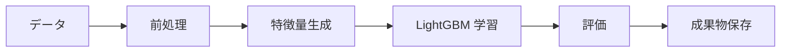
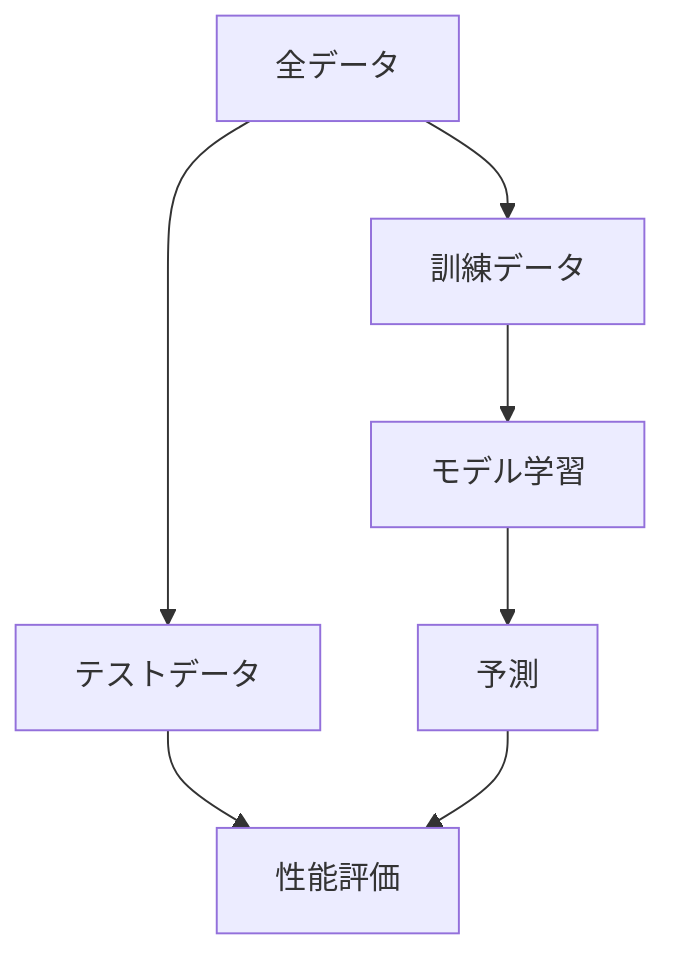
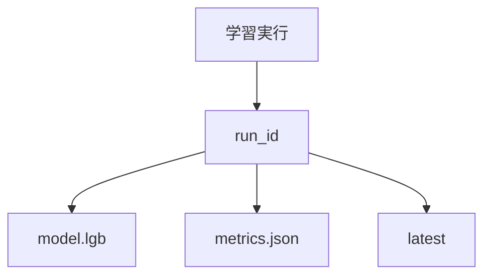
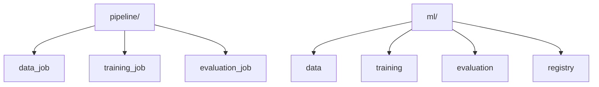

# 図解（Phase 1）

Phase 1 の教育資料で使う図解原稿。  
ML の基本工程を短く説明する用途に絞る。

---

## 図 1: ML の基本フロー

```mermaid
flowchart LR
    D[データ] --> P[前処理]
    P --> F[特徴量生成]
    F --> T[LightGBM 学習]
    T --> E[評価]
    E --> A[成果物保存]
```

---

## 図 2: 訓練 / テスト分割

```mermaid
flowchart TB
    All[全データ]
    All --> Train[訓練データ]
    All --> Test[テストデータ]
    Train --> Model[モデル学習]
    Model --> Pred[予測]
    Test --> Score[性能評価]
    Pred --> Score
```

---

## 図 3: 成果物管理

```mermaid
flowchart TB
    Train[学習実行] --> Run[run_id]
    Run --> Model[model.lgb]
    Run --> Metrics[metrics.json]
    Run --> Latest[latest]
```

---

## 図 4: Phase 1 のディレクトリ観

```mermaid
flowchart TB
    P[pipeline/] --> D[data_job]
    P --> T[training_job]
    P --> E[evaluation_job]
    M[ml/] --> M1[data]
    M --> M2[training]
    M --> M3[evaluation]
    M --> M4[registry]
```
