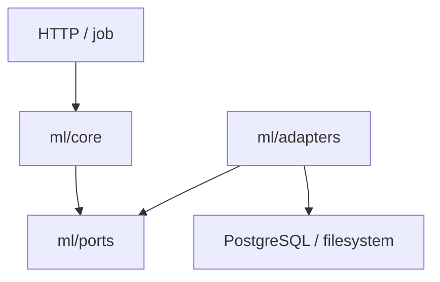
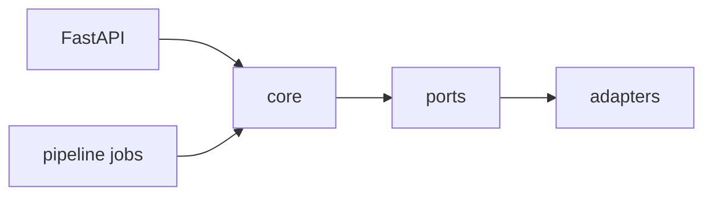
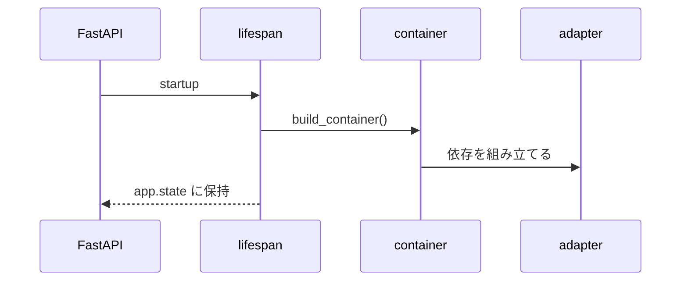
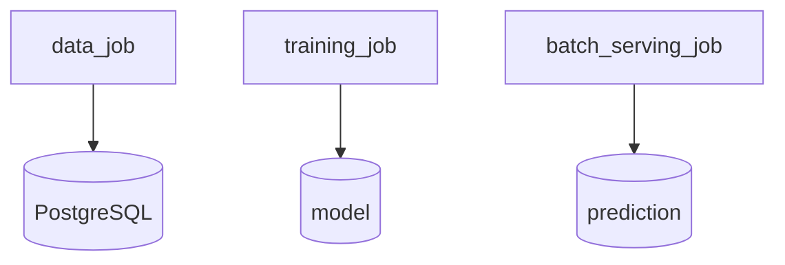

# 図解（Phase 2）

Phase 2 の教育資料で使う図解原稿。  
Port/Adapter と App + Pipeline の入口整理に集中する。

---

## 図 1: 依存方向

```mermaid
flowchart TB
    In[HTTP / job] --> Core[ml/core]
    Core --> Ports[ml/ports]
    Adapters[ml/adapters] --> Ports
    Adapters --> Infra[PostgreSQL / filesystem]
```

---

## 図 2: FastAPI と job の位置づけ

```mermaid
flowchart LR
    API[FastAPI] --> Core[core]
    Job[pipeline jobs] --> Core
    Core --> Ports[ports]
    Ports --> Adapters[adapters]
```

---

## 図 3: lifecycle と DI

```mermaid
sequenceDiagram
    participant App as FastAPI
    participant Life as lifespan
    participant C as container
    participant A as adapter
    App->>Life: startup
    Life->>C: build_container()
    C->>A: 依存を組み立てる
    Life-->>App: app.state に保持
```

---

## 図 4: job 分離

```mermaid
flowchart TB
    Seed[data_job]
    Train[training_job]
    Batch[batch_serving_job]
    Seed --> DB[(PostgreSQL)]
    Train --> Model[(model)]
    Batch --> Result[(prediction)]
```
