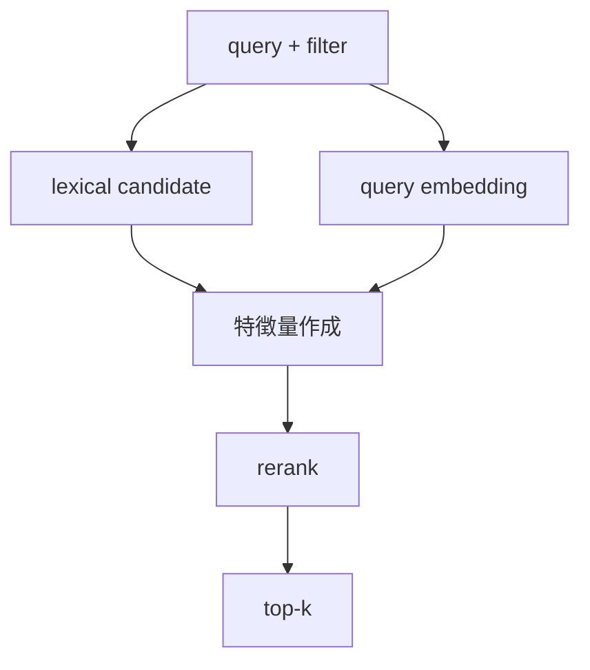
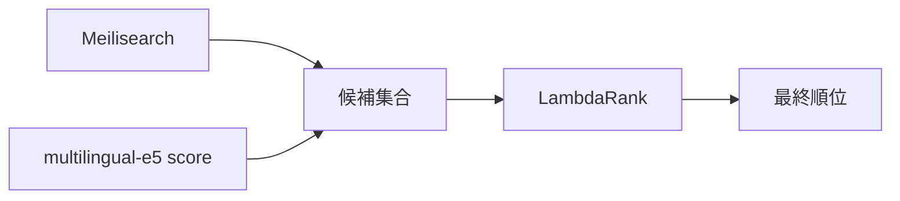
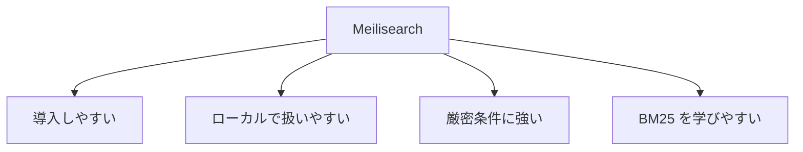

# 図解（Phase 3）

Phase 3 の教育資料で使う図解原稿。  
ハイブリッド検索の 3 段構成が伝わるものだけを残す。

---

## 図 1: 全体アーキテクチャ

```mermaid
flowchart LR
    U[ユーザー] --> API[/search]
    API --> Meili[Meilisearch]
    API --> E5[multilingual-e5]
    API --> Rank[LightGBM LambdaRank]
    API --> Cache[Redis]
    Rank --> Resp[検索結果]
```

---

## 図 2: 処理の流れ



---

## 図 3: 候補取得と再ランキングの分担



---

## 図 4: Meilisearch を使う理由


