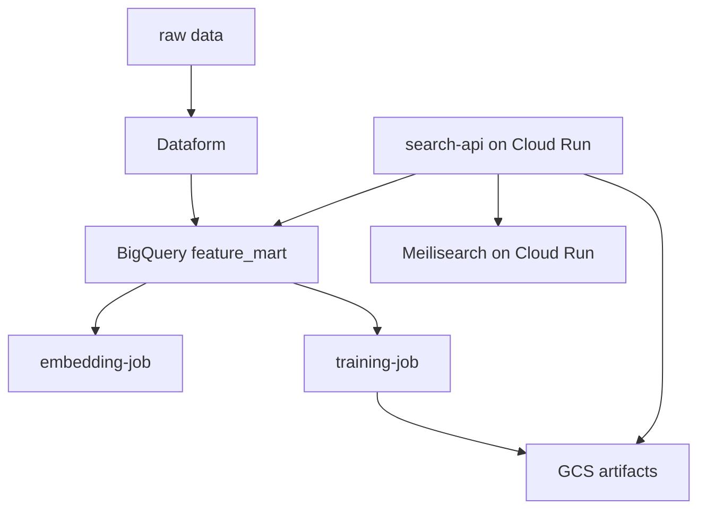
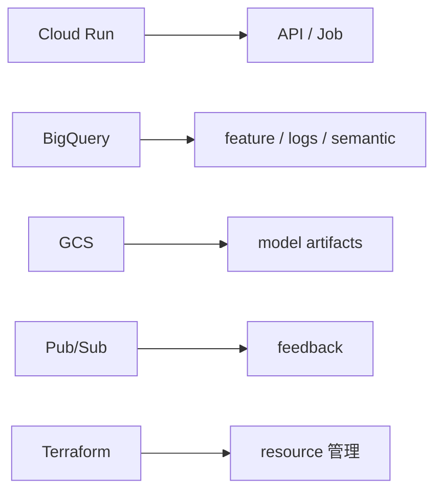
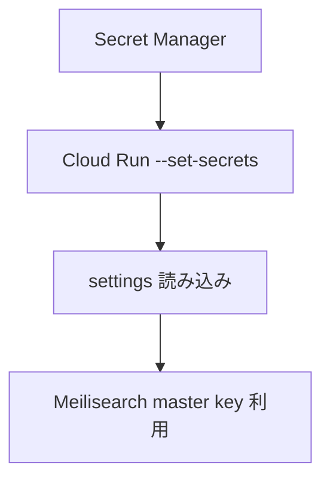

# 図解（Phase 4）

Phase 4 の教育資料で使う図解原稿。  
ローカル検索を GCP 実行基盤へ移す構図を説明する。

---

## 図 1: GCP 全体像



---

## 図 2: GCP 技術と工程



---

## 図 3: Secret Manager の流れ



---

## 図 4: 再学習ループ

```mermaid
flowchart LR
    Search[/search] --> Log[ranking_log]
    User[feedback] --> FB[feedback_events]
    Log --> Retrain[training-job]
    FB --> Retrain
    Retrain --> Model[GCS / training_runs]
```
