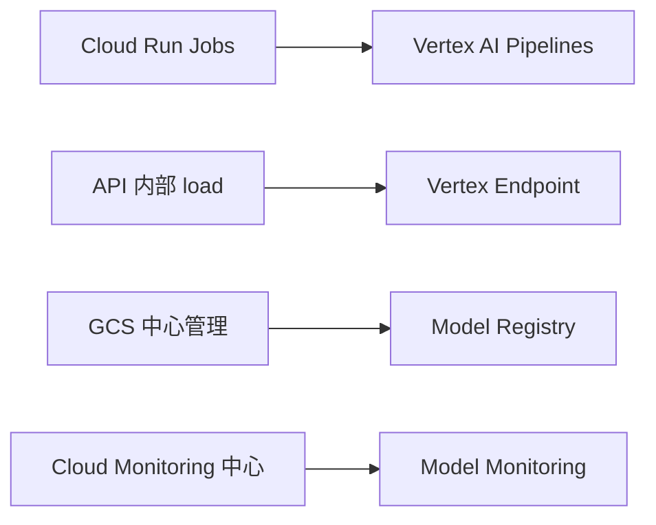
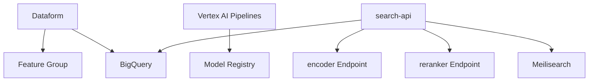
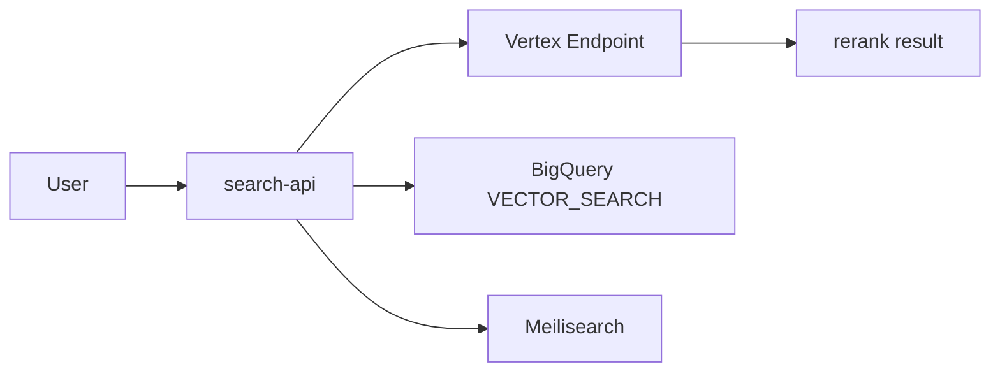
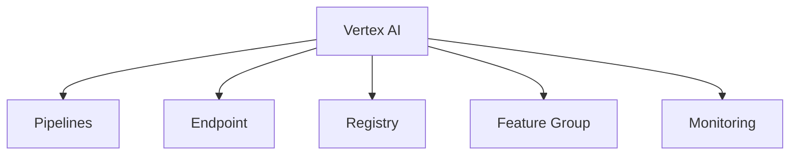

# 図解（Phase 5）

Phase 5 の教育資料で使う図解原稿。  
Phase 4 から Vertex 標準 MLOps へ責務を移す図だけを残す。

---

## 図 1: Phase 4 → Phase 5 の責務移動

---

## 図 2: Phase 5 全体像

---

## 図 3: search-api の役割変化

---

## 図 4: Vertex 標準機能の整理

