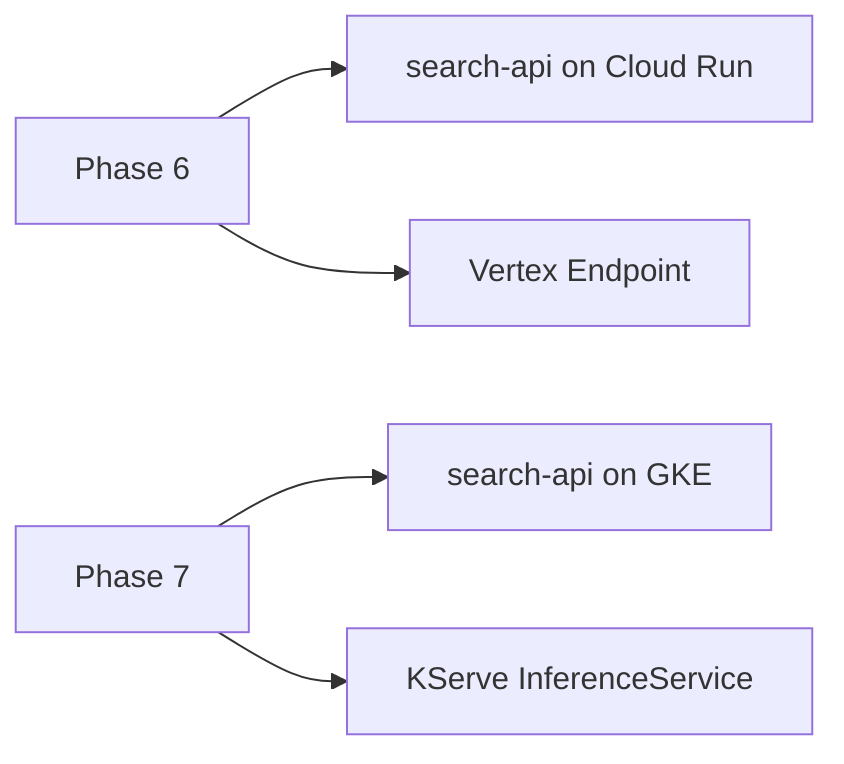
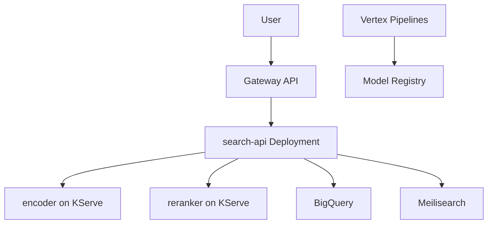
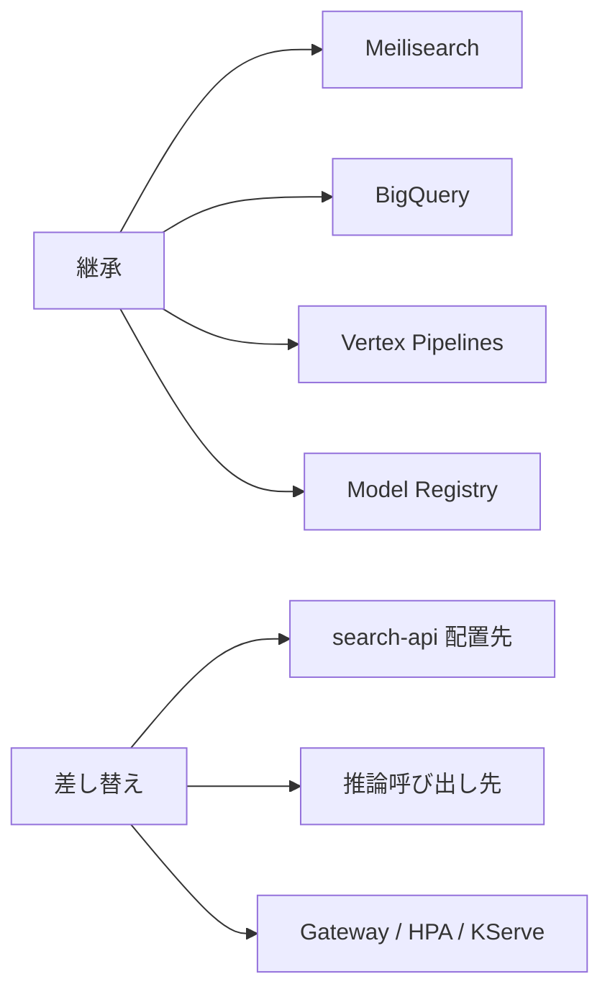
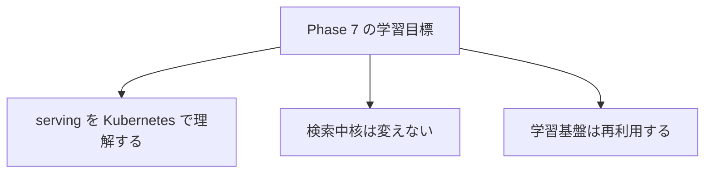

# 図解（Phase 7）

Phase 7 の教育資料で使う図解原稿。  
Serving 層だけを GKE + KServe に差し替えることが主題。

---

## 図 1: Phase 6 → Phase 7 の差し替え

---

## 図 2: Phase 7 全体像

---

## 図 3: 変わらないもの / 変わるもの

---

## 図 4: serving 差分に集中する理由

