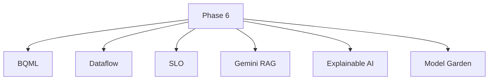
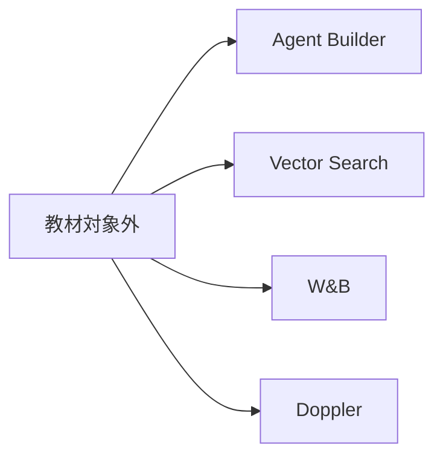

# 図解（Phase 6）

Phase 6 の教育資料で使う図解原稿。  
追加技術を「本流を壊さずに足す」ことが伝わる図に限定する。

---

## 図 1: default と opt-in

```mermaid
flowchart TB
    Search[/search]
    Search --> Default[default: Phase 5 のまま]
    Search --> OptIn[opt-in: 追加技術]
    OptIn --> Explain[Explainable AI]
    OptIn --> BQML[BQML 補助]
    OptIn --> RAG[Gemini RAG]
```

---

## 図 2: 本流と副経路

```mermaid
flowchart LR
    Core[Meilisearch + BQ VECTOR_SEARCH + RRF + LambdaRank]
    Core --> Resp[通常検索結果]
    Core --> Explain[explain 付き応答]
    Core --> Rag[/rag]
    Side[Dataflow / SLO / BQML] --> Core
```

---

## 図 3: 追加技術の整理



---

## 図 4: 学習対象外


