# study-gcp-mlops

MLOps 学習用の **7 フェーズ構成リポジトリ**。
**全フェーズを単一の親 Git リポジトリで管理**し、Phase ごとに学習対象を段階的に広げる。Phase 7 (GKE + KServe) を到達ゴールとする。

各 Phase の正本は phase 配下ドキュメント。本ファイルは全体ナビゲーションを担う。

---

## 1. 全体方針

### Phase 設計の軸

- Phase 1: **ML 基礎に集中**(学習・評価・保存)
- Phase 2: **App / Pipeline / Port-Adapter** を導入
- Phase 3-5: 不動産検索ドメインで **Local → GCP → Vertex AI** へ展開
- Phase 6: Phase 5 と**同じ不動産ハイブリッド検索ドメインを維持**し、PMLE 試験範囲の追加技術を Phase 5 実コードに **adapter / 副経路 / 追加エンドポイント / 追加 Terraform** として統合
- Phase 7: **Phase 6 の serving 層を GKE + KServe に置き換える到達ゴール**(Vertex AI Pipelines / **Vertex AI Feature Store (Feature Group / Feature View / Feature Online Store)** / **Vertex Vector Search** / **Cloud Composer orchestration (Phase 6 起点)** / Model Registry / BigQuery / Meilisearch 等は Phase 6 から継承。Feature Online Store は Phase 5 構築済を KServe から **Feature View 経由で** opt-in 参照)

### 設計思想の不変性

- Phase 間のコードは原則共有しない(教材としての独立性を優先)
- ただし **設計思想(Port/Adapter、`core → ports ← adapters` 層構造、依存方向)は一貫**させ、**adapter 実装だけ差し替える** のが本リポジトリの軸
- 実行方式の段差(Docker Compose → uv + クラウド → Vertex → GKE)は「同じ設計思想を維持し、実行基盤だけ段階的に置き換える」ための学習設計

### 教材対象外(全 Phase 禁止)

- 🚫 **教材対象外(禁止)**: **Agent Builder / Vizier / Model Garden / Gemini RAG** — ハイブリッド検索中核 (Meilisearch BM25 + Vertex Vector Search (Phase 5+) / BigQuery `VECTOR_SEARCH` (Phase 4) + multilingual-e5 + RRF + LightGBM LambdaRank) と機能カニバリを起こす、もしくは学習価値が低いため、全 Phase で導入・言及しない
- 📝 **Vertex Vector Search はセマンティック検索の本番 serving index**: 実案件想定に合わせて Phase 5 以降は ME5 ベクトルの ANN 検索を Vertex Vector Search で行い serving 経路もそこへ寄せる。**embedding 生成履歴・メタデータの正本は引き続き BigQuery 側に置く** (Vertex Vector Search は serving 用 index、BQ は data lake)。Phase 4 のみ既存の BigQuery `VECTOR_SEARCH` 経路を維持する(GCP マネージドサービス基礎習得のため)
- **W&B / Looker Studio / Doppler は教材対象外**(2026-04-24 決定)。実験履歴は Phase 1-3 で `runs/{run_id}/` + JSON/CSV metrics + git commit hash、Phase 4 以降で GCS / BigQuery / Vertex Model Registry / Vertex Pipelines Metadata へ段階移行

---

## 2. Phase 一覧

| Phase | ディレクトリ | テーマ | 主な学習ポイント | 主な技術 | 実行方式 |
|---|---|---|---|---|---|
| 1 | `1/study-ml-foundations/` | ML 基礎(回帰) | preprocess / feature engineering / training / evaluation / artifact 出力 (model.pkl / metrics.json / params.yaml / `runs/{run_id}/`) | LightGBM, PostgreSQL | Docker Compose |
| 2 | `2/study-ml-app-pipeline/` | App + Pipeline + Port/Adapter | FastAPI lifespan DI, `core → ports ← adapters`, predictor 経由推論、seed/train/predict job 分離 | FastAPI, LightGBM, PostgreSQL | Docker Compose |
| 3 | `3/study-hybrid-search-local/` | 不動産ハイブリッド検索(Local) | lexical + semantic + rerank、LambdaRank、RRF、Port/Adapter 実践 | Meilisearch, multilingual-e5, LightGBM LambdaRank, Redis, uv | uv + Docker Compose |
| 4 | `4/study-hybrid-search-gcp/` | 不動産ハイブリッド検索(GCP) | GCP マネージドサービス化、RRF、再学習ループ、IaC/CI、**BigQuery feature table / view の土台作成** (Phase 5 Feature Store の入力源)、**Secret Manager → Cloud Run secret injection(必須習得)** | Cloud Run, GCS, BigQuery, Cloud Logging, **Secret Manager**, **Pub/Sub, Eventarc, Cloud Scheduler, Artifact Registry, Cloud Build**, Terraform, WIF, GitHub Actions | uv + クラウド実行基盤 |
| 5 | `5/study-hybrid-search-vertex/` | Vertex AI 本番MLOps基盤移行 | Vertex Pipelines (KFP v2) / Endpoint / Model Registry / Monitoring / Dataform への adapter 差し替え。**Vertex AI Feature Store (Feature Group / Feature View / Feature Online Store) により training-serving skew を防ぐ特徴量管理を必須化** (Online Store を使う実務では Feature View が serving 接続点)。**Vertex Vector Search を ME5 ベクトル検索の本番 serving index として採用** (BigQuery 側は embedding 生成履歴・メタデータ保持、Phase 4 の BQ `VECTOR_SEARCH` は置換)。Dataform は BigQuery feature table / view / embedding metadata table の管理に利用。**Phase 4 の Cloud Scheduler + Eventarc + Cloud Function trigger は軽量 orchestration 経路として継続** し、Vertex Pipelines / Feature Store 更新 / Vector Search index 更新を必要最小限で接続する (Composer 本線化は Phase 6 で行う = 引き算境界 Phase 5 → 6) | Vertex AI Pipelines, Vertex AI Endpoint, Vertex AI Model Registry, Vertex AI Model Monitoring, **Vertex AI Feature Store (Feature Group / Feature View / Feature Online Store)**, **Vertex Vector Search**, Dataform | uv + Vertex AI + Terraform |
| 6 | `6/study-hybrid-search-pmle/` | GCP PMLE + 運用統合ラボ (Phase 5 実コードへ統合) | PMLE 範囲の追加技術を adapter / 追加エンドポイント / Terraform として統合。**Cloud Composer / Managed Airflow Gen 3 を本線オーケストレーターとして導入** し、Dataform / Vertex AI Pipelines / Feature Store 更新 / Vertex Vector Search index 更新 / monitoring query を DAG で統合管理 (Phase 5 までの Cloud Scheduler + Eventarc + Cloud Function trigger は軽量代替経路 / smoke / manual trigger 用途として残す = Phase 5 → 6 引き算境界)。追加 DAG として Dataflow Flex Template / BQML training / Composer-managed BigQuery monitoring query を増設。Feature Store / Vertex Vector Search は Phase 5 前提。不変はハイブリッド検索中核 (`/search` default) のみ | BQML, Dataflow (Apache Beam Flex Template), **Cloud Composer / Managed Airflow Gen 3 (本線 orchestration、Phase 6 起点)**, Monitoring SLO + burn-rate alert, TreeSHAP / Explainability, **Composer-managed BigQuery monitoring query** | uv + Vertex AI + Composer + Terraform |
| 7 | `7/study-hybrid-search-gke/` | GKE/KServe 差分移行(到達ゴール) | Phase 6 のデータ基盤・Vertex AI Pipelines・Feature Store (Feature Group / Feature View / Feature Online Store)・Vertex Vector Search・**Cloud Composer orchestration** を継承し、serving 層のみ GKE + KServe へ置換。Kubernetes 運用論点は抑え、まず動かす。SLO は `k8s_service` 化し、TreeSHAP 用 explain 専用 Pod と、**Phase 5 で構築済みの Feature Online Store (Feature View 経由) を KServe から参照する経路** を追加 | GKE Autopilot, KServe, **Cloud Composer / Managed Airflow Gen 3 (Phase 6 → 7 と継承)**, Gateway API + HTTPRoute, External Secrets Operator, Workload Identity, GMP (PodMonitoring), HPA, IAP (GCPBackendPolicy), NetworkPolicy, Helm provider, **Vertex AI Feature Store (Feature Online Store / Feature View)** | uv + GKE Autopilot/KServe + Composer |

---

## 3. 教育フェーズ設計の補助図

> 本 README は **教育フェーズ設計** (どの Phase で何を学ぶか / 引き算戦略 / 学習順) の正本。**ハイブリッド検索の実装詳細図** (アプリ構成 / シーケンス / モデル関係 / ストレージ関係) は Phase 7 [`docs/01_仕様と設計.md` §2](7/study-hybrid-search-gke/docs/01_仕様と設計.md) が canonical なので、本ファイルでは Phase 段差と技術出現の 2 枚のみを置く。
>
> | 知りたいこと | 参照先 |
> |---|---|
> | アプリ構成 (Port/Adapter 6 軸) / `/search` シーケンス / モデル関係 / ストレージ関係 | [Phase 7 docs/01 §2](7/study-hybrid-search-gke/docs/01_仕様と設計.md) |
> | Composer × Vertex Pipelines 上下関係 / DAG 段差 / カニバリ NG | [Phase 7 docs/01 §3](7/study-hybrid-search-gke/docs/01_仕様と設計.md) |
> | Phase 段差 / Phase 別技術出現 (本ファイル) | 下記 図1 / 図2 |

### 図1. Phase 段差図 (Local ↔ GCP の関係、adapter 差し替え軸)

設計思想 (Port/Adapter / `core → ports ← adapters`) は **全 Phase で不変**。各 Phase で差し替わるのは **実行基盤と adapter 実装のみ**。

```mermaid
flowchart LR
    subgraph LOCAL["Local 実行 (Phase 1-3)"]
        P1["Phase 1<br/>ML 基礎"]
        P2["Phase 2<br/>App + Pipeline + Port/Adapter"]
        P3["Phase 3<br/>不動産検索 Local<br/>Meilisearch + ME5 + LightGBM<br/>Docker Compose + uv"]
    end

    subgraph GCP_BASE["GCP マネージド (Phase 4)"]
        P4["Phase 4<br/>Cloud Run + BigQuery<br/>BQ VECTOR_SEARCH + Meilisearch<br/>Cloud Scheduler + Eventarc + Cloud Function<br/>= 軽量 orchestration"]
    end

    subgraph VERTEX["Vertex AI 本番MLOps基盤 (Phase 5)"]
        P5["Phase 5<br/>Vertex Pipelines / Endpoint / Model Registry / Monitoring<br/>+ Vertex Vector Search ←必須<br/>+ Vertex Feature Store ←必須<br/>orchestration は Phase 4 軽量経路を継続"]
    end

    subgraph PMLE["PMLE + 運用統合 (Phase 6)"]
        P6["Phase 6<br/>Phase 5 継承<br/>+ Cloud Composer 本線昇格 ←引き算境界<br/>+ BQML / Dataflow / Monitoring SLO / Explainable AI"]
    end

    subgraph GKE["到達ゴール (Phase 7)"]
        P7["Phase 7<br/>Phase 6 継承<br/>+ serving 層のみ GKE + KServe に差し替え<br/>+ KServe → Feature Online Store (Feature View 経由) opt-in 参照"]
    end

    P1 -->|Port/Adapter 導入| P2
    P2 -->|検索ドメインへ展開| P3
    P3 -->|実行基盤を GCP マネージドへ| P4
    P4 -->|Vertex AI 本番MLOps基盤化| P5
    P5 -->|Composer + PMLE 運用統合| P6
    P6 -->|serving 層を K8s ネイティブへ| P7

    classDef local fill:#e8f5e9,stroke:#2e7d32
    classDef gcp fill:#e3f2fd,stroke:#1565c0
    classDef vertex fill:#fff3e0,stroke:#e65100
    classDef pmle fill:#f3e5f5,stroke:#6a1b9a
    classDef gke fill:#ffebee,stroke:#c62828,stroke-width:3px
    class P1,P2,P3 local
    class P4 gcp
    class P5 vertex
    class P6 pmle
    class P7 gke
```



### 図2. Phase 別 技術出現図 (どの Phase で何が初登場するか)

教育設計の俯瞰用。**どの Phase で何が初めて入るか** を見るための図 (実装的な依存関係 / 配線詳細は Phase 7 [`docs/01_仕様と設計.md` §2.5](7/study-hybrid-search-gke/docs/01_仕様と設計.md) を参照)。

```mermaid
flowchart LR
    subgraph P3["Phase 3 (Local)"]
        P3_TECH["Meilisearch / multilingual-e5 /<br/>LightGBM LambdaRank / Redis /<br/>Docker Compose / uv"]
    end

    subgraph P4["Phase 4 (GCP Serverless)"]
        P4_TECH["Cloud Run / GCS / BigQuery /<br/>Cloud Logging / Pub/Sub / Eventarc /<br/>Cloud Scheduler / Cloud Function /<br/>Secret Manager / Terraform / WIF /<br/>BQ VECTOR_SEARCH / Dataform"]
    end

    subgraph P5["Phase 5 (Vertex AI 本番MLOps基盤)"]
        P5_TECH["Vertex AI Pipelines (KFP v2) /<br/>Vertex Endpoint /<br/>Vertex Model Registry /<br/>Vertex Model Monitoring /<br/><b>Vertex AI Feature Store</b><br/>(Feature Group / Feature View / Online Store) /<br/><b>Vertex Vector Search</b>"]
    end

    subgraph P6["Phase 6 (PMLE + Composer 本線)"]
        P6_TECH["<b>Cloud Composer (本線)</b> /<br/>BQML / Dataflow Flex Template /<br/>TreeSHAP Explainability /<br/>Monitoring SLO + burn-rate /<br/>Composer-managed BQ monitoring query"]
    end

    subgraph P7["Phase 7 (GKE + KServe)"]
        P7_TECH["GKE Autopilot / KServe /<br/>Gateway API + HTTPRoute /<br/>External Secrets Operator /<br/>Workload Identity / GMP / HPA /<br/>IAP / NetworkPolicy / Helm provider /<br/>Feature Online Store (Feature View 経由) opt-in"]
    end

    P3 -->|+ GCP マネージド化| P4
    P4 -->|+ Vertex AI 本番MLOps基盤| P5
    P5 -->|+ Composer 本線昇格 / PMLE 追加| P6
    P6 -->|serving 層を K8s ネイティブへ| P7

    classDef local fill:#e8f5e9,stroke:#2e7d32
    classDef gcp fill:#e3f2fd,stroke:#1565c0
    classDef vertex fill:#fff3e0,stroke:#e65100
    classDef pmle fill:#f3e5f5,stroke:#6a1b9a
    classDef gke fill:#ffebee,stroke:#c62828,stroke-width:2px
    class P3 local
    class P4 gcp
    class P5 vertex
    class P6 pmle
    class P7 gke
```



各技術の役割 / 上下関係 (Composer × Vertex Pipelines) / 配線は Phase 7 [`docs/01_仕様と設計.md` §2 / §3](7/study-hybrid-search-gke/docs/01_仕様と設計.md) が canonical。

---

## 4. 基本戦略：「引き算」によるPhase間コード生成

### 4.1 起点
- **Phase 7 (`7/study-hybrid-search-gke/`) を最終形・正本コードとする**
- Phase 7のコードを起点に、後方Phase（6 → 5 → 4 → 3 → 2 → 1）へ向かって**引き算で派生コードを生成する**

### 4.2 派生フロー（厳守）

```
Phase 7 (起点)
  ↓ 引き算
Phase 6 (= Phase 7 から GKE/KServe 等を引いたもの)
  ↓ 引き算
Phase 5 (= Phase 6 から PMLE追加技術 を引いたもの)
  ↓ 引き算
Phase 4 (= Phase 5 から Vertex AI 標準MLOps を引いたもの)
  ↓ 引き算
Phase 3 (= Phase 4 から GCPマネージド を引いたもの)
  ↓ 引き算
Phase 2 (= Phase 3 からハイブリッド検索 を引いたもの)
  ↓ 引き算
Phase 1 (= Phase 2 から App/Pipeline/Port-Adapter を引いたもの)
```

### 4.3 引き算の対応関係（明示）

| 生成対象Phase | コピー元 | 引き算する技術領域 |
|---|---|---|
| Phase 6 | Phase 7 | GKE Autopilot, KServe, Gateway API + HTTPRoute, External Secrets Operator, Workload Identity, GMP (PodMonitoring), HPA, IAP (GCPBackendPolicy), NetworkPolicy, Helm provider, **KServe → Feature Online Store (Feature View 経由) opt-in 参照経路**, **TreeSHAP 用 explain 専用 Pod** |
| Phase 5 | Phase 6 | BQML, Dataflow (Apache Beam Flex Template), **Cloud Composer / Managed Airflow Gen 3 (本線 orchestration)**, Monitoring SLO + burn-rate alert, TreeSHAP / Explainability, **Composer-managed BigQuery monitoring query** |
| Phase 4 | Phase 5 | Vertex AI Pipelines (KFP v2), Vertex Endpoint, Vertex Model Registry, Vertex Model Monitoring, **Vertex AI Feature Store (Feature Group / Feature View / Feature Online Store)**, **Vertex Vector Search** |
| Phase 3 | Phase 4 | Cloud Run, GCS, BigQuery, Cloud Logging, Secret Manager, Pub/Sub, Eventarc, Cloud Scheduler, Artifact Registry, Cloud Build, Terraform, WIF, GitHub Actions |
| Phase 2 | Phase 3 | Meilisearch, multilingual-e5, LightGBM LambdaRank, Redis（ハイブリッド検索一式） |
| Phase 1 | Phase 2 | FastAPI, lifespan DI, core/ports/adapters構造, seed/predict job |

### Cloud Composer の位置づけ (Phase 6 で導入、Phase 7 で継承)

**要点** (canonical な詳細仕様は **Phase 7 [`docs/01_仕様と設計.md` §3](7/study-hybrid-search-gke/docs/01_仕様と設計.md)** を参照):

- **Phase 6 で本線昇格、Phase 7 で継承** (Phase 5 までは Cloud Scheduler + Eventarc + Cloud Function の軽量経路)。**Phase 5 → 6 が引き算境界**
- **Composer (上位 orchestrator) × Vertex Pipelines (下位 ML executor) の上下関係** で運用 — 同責務を両層に持たせない
- **Phase 6 で Vertex `PipelineJobSchedule` は完全撤去**、他の trigger (Cloud Scheduler / Eventarc / Cloud Function) は軽量代替・smoke 用途として残す (本線と二重起動はしない)
- **Phase 5 で Composer を導入しない理由**: Vertex AI 本番 MLOps 基盤 (Pipelines / Feature Store / Vector Search) の構築に集中させ、運用統合 (Composer DAG 化) は Phase 6 に分離することで、コスト / 切り分け負荷を抑える

内部マイルストーン (Phase 5: 5A-5D / Phase 6: 6A-6B) と Phase 別 DAG 段差表 / カニバリ NG 一覧 / ディレクトリ構成は Phase 7 docs/01 §3.5-3.6 が canonical。図 6 (アーキテクチャ全体像) も参照。

### Phase 2 → 3 の接続(飛躍を埋める短い説明)

Phase 2 で学んだ **Port/Adapter を、より複雑なドメインで実践する** のが Phase 3。具体的には:

- ドメインが 回帰(単発予測) → **検索(lexical + semantic + rerank の多段構成)** になる
- ML タスクが 回帰 → **ランキング学習(LambdaRank / NDCG)** になる
- Adapter が増える: Meilisearch(BM25)、multilingual-e5(Embedding)、Redis(キャッシュ)
- 「同じ Port 抽象に、複数 adapter を差し込む」のが Phase 3 で初めて本格化する

設計思想は Phase 2 と同じだが、**ドメイン複雑度と adapter 数が一段上がる** と捉えるとスムーズ。

### リポジトリ構成

```text
study-gcp-mlops/
├── 1/study-ml-foundations/
├── 2/study-ml-app-pipeline/
├── 3/study-hybrid-search-local/
├── 4/study-hybrid-search-gcp/
├── 5/study-hybrid-search-vertex/
├── 6/study-hybrid-search-pmle/
├── 7/study-hybrid-search-gke/   # 到達ゴール (GKE + KServe)
└── docs/
```

---

## 5. 非負制約(必須)

### 全 Phase 共通

- 教材対象外技術([§1 教材対象外](#教材対象外全-phase-禁止) 参照)を導入しない
- 設計思想(Port/Adapter / 依存方向 / `core → ports ← adapters`)を破壊しない

### Phase 3-7(ハイブリッド検索系)

- ハイブリッド検索の基盤は **LightGBM + multilingual-e5 + Meilisearch** を維持
- 検索品質改善は「この 3 要素を前提にした上で」実施
- 置換・削減・無効化は事前に明示的な合意を必要とする

### Phase 6 追加(PMLE 統合特有)

- **題材は Phase 5 と同じ不動産ハイブリッド検索ドメインを維持**(PMLE 試験がケーススタディ形式であること、Phase 3-5 との設計思想の一貫性、Responsible AI の実題材化が理由)
- **ハイブリッド検索中核コード (Meilisearch BM25 + Vertex Vector Search + multilingual-e5 + RRF + LightGBM LambdaRank) の挙動は絶対に変えない**(Phase 6 起点。Phase 4 は BigQuery `VECTOR_SEARCH` を、Phase 5 以降は Vertex Vector Search を使う)
- **中核以外の改変は PMLE 学習のため自由に行う** — 新 Port / Adapter / Service / Endpoint / KFP component / Terraform モジュール / parity 6 ファイル同 PR 更新を積極的に使う
- **default feature flag では Phase 5 挙動を維持**(新技術は opt-in で有効化)
- **`make check` / parity invariant / Port/Adapter 境界検知 / WIF** は追加コードも含めて継続して PASS させる
- 中核を変える提案 (Meilisearch 置換 / LambdaRank 置換 / RRF 廃止 等) は事前に明示的な合意を必要とする

### Phase 7 追加(到達ゴール)

- **Phase 6** の学習/データ基盤をそのまま継承し、serving 層のみ差し替える

---

## 6. 学習運用 (Phase 別 成果物の置き場 — 教育設計レベルの段差表)

Phase ごとに成果物・評価結果・実行履歴の置き場を **段階移行** させる。具体的なコマンド / SA bind / IAM 設定など実装詳細は phase 配下 `docs/04_運用.md` (Phase 7 は `docs/05_運用.md`) が正本。本表は「どの Phase で何が登場するか」の俯瞰のみ。

### 全 Phase 共通ツール

Phase 表には各 Phase で**新規に登場する**技術を載せる。下記は Phase を跨いで継続利用:

| ツール | 役割 | 初登場 | 本格活用 |
|---|---|---|---|
| Git / commit hash | 親リポ単一管理 + 再現性 | リポジトリ開始 | 全 Phase |
| pytest | テストランナー | Phase 1 | 全 Phase |
| pydantic-settings (YAML) | 設定とシークレットの分離 | Phase 1 | 全 Phase |
| Docker / Docker Compose | ローカル実行基盤 | Phase 1 | Phase 1-3 |
| uv | Python 依存管理 | Phase 3 | Phase 3-7 |

### Phase 別 成果物・評価・ログの置き場 (段差俯瞰)

| Phase | モデル | 評価 / 実験履歴 | ログ / 監視 | CI/CD / IaC | 秘匿情報 |
|---|---|---|---|---|---|
| 1-3 (Local) | `model.pkl` (local filesystem) | `runs/{run_id}/` + JSON/CSV metrics | local | — | local `.env` |
| 4 (GCP Serverless) | GCS | BigQuery table | Cloud Logging + Cloud Monitoring | GitHub Actions + WIF + Terraform | **Secret Manager → Cloud Run secret injection (必須習得)** |
| 5 (Vertex AI 本番MLOps基盤) | **Vertex Model Registry** (昇格運用) | **Vertex Pipelines Metadata** (lineage) | Cloud Monitoring + **Vertex Model Monitoring** | Phase 4 継承 | Phase 4 継承 |
| 6 (PMLE + Composer 本線) | Phase 5 継承 | Phase 5 継承 | Phase 5 継承 + **Composer-managed BQ monitoring query** + SLO + burn-rate | Phase 5 継承 | Phase 5 継承 |
| 7 (GKE + KServe) | Phase 6 継承 | Phase 6 継承 | Phase 6 継承 + **GMP (PodMonitoring)** | Phase 6 継承 | + **External Secrets Operator** (Secret Manager → K8s Secret 自動同期) |

Phase 5+ で必須となる **Vertex AI Feature Store** (Feature Group / Feature View / Feature Online Store、training-serving skew 防止) と **Vertex Vector Search** (ME5 ベクトルの本番 serving index、BQ は embedding 履歴正本) は §2 Phase 一覧と Phase 7 [`docs/01_仕様と設計.md`](7/study-hybrid-search-gke/docs/01_仕様と設計.md) §2 を参照。

### 運用ルール (共通)

- 変更は原則 Phase 単位で閉じる
- 学習用途のため、重複コードは許容 (意図的複製)、Phase を跨ぐ共有ライブラリ化は優先しない
- ドキュメントは「現行フェーズの実態」を最優先で更新する

---

## 7. まずどこから始めるか

### 学習順(推奨)

Phase 1 → 2 → 3 → 4 → 5 → 6 → 7 の番号順。

### 目的別ショートカット(前提 Phase を併記)

- **ML 基礎だけ学ぶ**: Phase 1(前提なし)
- **設計パターン(Port/Adapter)を学ぶ**: Phase 2, 3(前提: Phase 1 相当の ML 基礎知識)
- **GCP MLOps の運用全体**: Phase 4(前提: Phase 3 の Port/Adapter 理解)
- **Vertex AI への移行差分**: Phase 5(前提: Phase 4 の GCP 構成理解)
- **GCP ML Engineer 認定相当の総仕上げ**: Phase 6(前提: Phase 4/5 の GCP / Vertex 構成理解。PMLE 試験範囲の技術を Phase 5 実コードに adapter / 新規コンポーネントとして統合して学ぶ。不変はハイブリッド検索中核のみ)
- **GKE/KServe への serving 差分移行(到達ゴール)**: Phase 7(前提: Phase 5/6 の Vertex 構成理解 + Kubernetes 基礎)

---

## 8. 主要ドキュメント

### 正本(Phase-local が最優先)

- 各 Phase 配下の `README.md` / `CLAUDE.md` / `docs/` — その Phase の実態を正とする(最優先)

### 全体横断ハブ

- `docs/README.md` — ルート docs の入口と参照優先順位
- `docs/01_仕様と設計.md` — Phase 1〜7 の仕様設計ハブ
- `docs/03_実装カタログ.md` — Phase 1〜7 の実装カタログハブ
- `docs/04_運用.md` — Phase 1〜7 の運用ハブ
- `docs/conventions/` — 規約・配置・命名の正本セット (`命名規約.md` / `フォルダ-ファイル.md` / `スクリプト規約.md` / `Makefile規約.md` / `Docker配置規約.md` + 索引 README)
- `docs/phases/README.md` — Phase 別 docs 入口

### Phase 個別入口

- `docs/phases/phase1/README.md` 〜 `docs/phases/phase5/README.md`
- `6/study-hybrid-search-pmle/README.md`(PMLE 技術を Phase 5 実コードに実統合、2026-04-24 完了)
- `6/study-hybrid-search-pmle/docs/01_仕様と設計.md`(統合トピック詳細 + ファイル配置図)
- `6/study-hybrid-search-pmle/docs/02_移行ロードマップ.md`(決定的仕様)
- `7/study-hybrid-search-gke/docs/02_移行ロードマップ.md`(到達ゴール: GKE + KServe。**§4 Wave 2 = クラウド側 (GCP インフラ) の修正作業計画の母艦** — Terraform / IAM / Manifest / backfill / Composer 継承 / default flip の実施順序 W2-1〜W2-9)

### 過去の設計判断ログ(archive)

- `docs/archive/` — 完了済み作業の履歴・判断ログを保管
- `docs/archive/README.md` — archive 運用ルール

---

## 9. 設計判断の経緯

### Phase 1 → 2 の分割

- Phase 1 から `app/` と推論系を分離し、学習基礎フェーズに限定
- Phase 2 を新設し、API・DI・Port/Adapter・job 分離を導入
- Phase 1 と Phase 2 は独立運用(import 共有しない)
- モデル成果物の共有はしない前提(Phase 2 は Phase 2 内で学習して自己完結)

### ドメイン選定(Phase 3 以降は不動産検索に統一)

構想段階では社内規定検索・商品検索など複数ドメイン案があったが、Phase 3 以降は **不動産検索ドメインに統一** した。Phase 6 も Phase 5 からドメインを引き継ぐ(PMLE 認定勉強のための独立ドメインは作らない)。

統一理由:

- **lexical(キーワード / フィルタ)と semantic(意味類似)の両方が効くタスク** であり、ハイブリッド検索の教材として自然
- **ランキング学習(行動ログ → LambdaRank)の題材として適切な複雑さ** を持つ
- Phase 2 → 3 → 4 → 5 の移植の学びに集中するため、**ドメインを動かさず実行基盤だけ置き換える** 構成にしたかった
- Phase 6 (PMLE 総仕上げ) でも **Phase 5 実装を動くコードとして使い、そこに新技術を adapter / 新規コンポーネントとして統合する** 方が、抽象トピック暗記より試験対策として有利。Responsible AI (Explainable AI) を reranker endpoint に attach する、BQML を再ランキング用副経路として bolt-on する、といった実装を通じて PMLE 試験範囲の判断軸を手を動かして身につける

学習者が「モデル課題」ではなく **「設計と移行差分」** を追える構成を重視している。

### 検索エンジン(Phase 3 以降): Meilisearch

実務(特に大規模本番環境)では **Elasticsearch / OpenSearch** が採用される場面が多いが、本リポジトリでは Meilisearch を採用する:

- **学習目的では Meilisearch で十分** — BM25 全文検索 + 構造化フィルタ(`city` / `price_lte` / `walk_min` 等)という本リポの要件を素直にカバーできる
- **セットアップコストが低い** — 単一バイナリ・軽量 Docker image・チューニング項目が少ないため、**学習関心事(Port/Adapter、semantic 統合、RRF、rerank)に集中できる**
- **adapter 差し替えで Elasticsearch へ切り替え可能** — Phase 3 で lexical 層を Port/Adapter の背後に隠しているため、**本番想定では `MeilisearchAdapter` を `ElasticsearchAdapter` に差し替えるだけ** で切り替え可能(= 本リポジトリの軸「設計思想は一貫、adapter だけ差し替え」の具体例)
- **実案件 reference architecture** は Phase 5 の [`docs/01_仕様と設計.md` の §「実案件想定の reference architecture」](5/study-hybrid-search-vertex/docs/01_仕様と設計.md) を参照(Elasticsearch + Redis 同義語辞書 + ME5 + Vertex Vector Search + LightGBM の構成。本リポでは Meilisearch + Redis cache がその学習用 substitute)

他の選定(LightGBM / multilingual-e5 / Redis / Vertex Vector Search (Phase 5+) / BigQuery `VECTOR_SEARCH` (Phase 4) 等)は各 Phase の CLAUDE.md / README に理由を記載。
