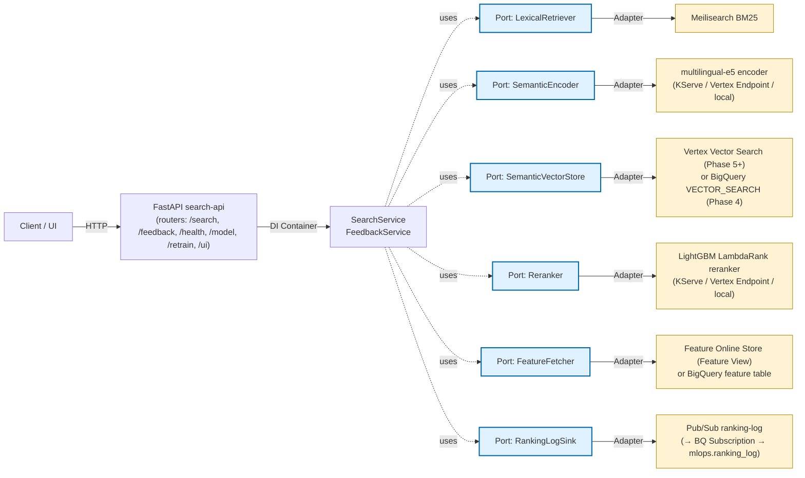
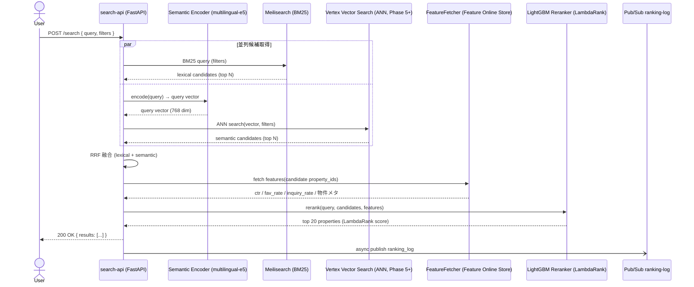
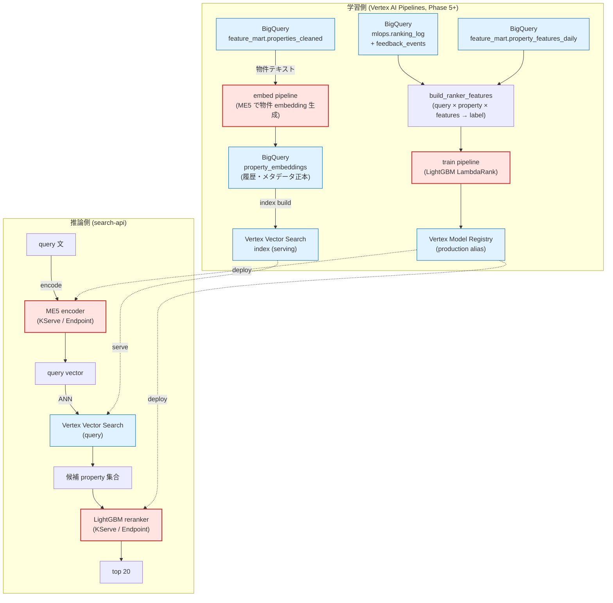
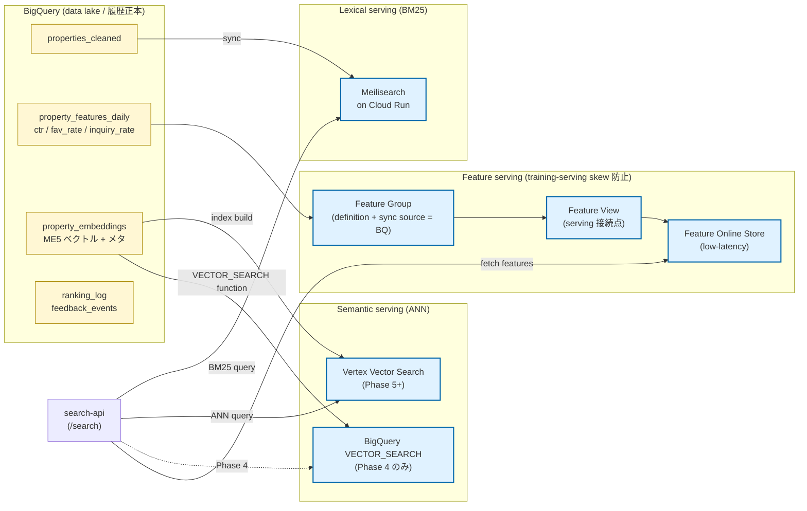
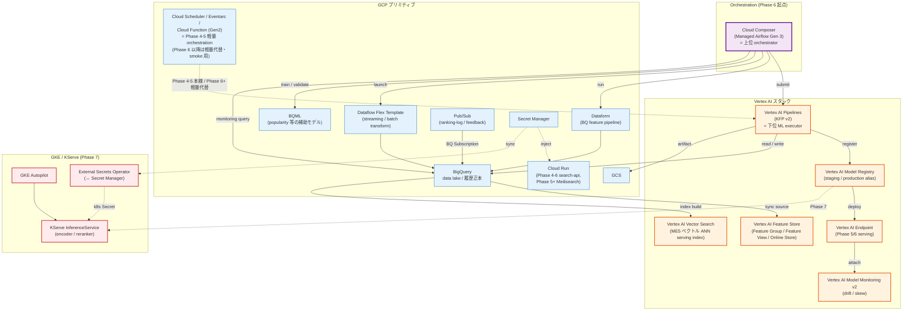

# study-gcp-mlops

MLOps 学習用の **7 フェーズ構成リポジトリ**。
**全フェーズを単一の親 Git リポジトリで管理**し、Phase ごとに学習対象を段階的に広げる。Phase 7 (GKE + KServe) を到達ゴールとする。

各 Phase の正本は phase 配下ドキュメント。本ファイルは全体ナビゲーションを担う。

---

## 1. 全体方針

### Phase 設計の軸

- Phase 1: **ML 基礎に集中**(学習・評価・保存)
- Phase 2: **App / Pipeline / Port-Adapter** を導入
- Phase 3-5: 不動産検索ドメインで **Local → GCP → Vertex AI** へ展開
- Phase 6: Phase 5 と**同じ不動産ハイブリッド検索ドメインを維持**し、PMLE 試験範囲の追加技術を Phase 5 実コードに **adapter / 副経路 / 追加エンドポイント / 追加 Terraform** として統合
- Phase 7: **Phase 6 の serving 層を GKE + KServe に置き換える到達ゴール**(Vertex AI Pipelines / **Vertex AI Feature Store (Feature Group / Feature View / Feature Online Store)** / **Vertex Vector Search** / **Cloud Composer orchestration (Phase 6 起点)** / Model Registry / BigQuery / Meilisearch 等は Phase 6 から継承。Feature Online Store は Phase 5 構築済を KServe から **Feature View 経由で** opt-in 参照)

### 設計思想の不変性

- Phase 間のコードは原則共有しない(教材としての独立性を優先)
- ただし **設計思想(Port/Adapter、`core → ports ← adapters` 層構造、依存方向)は一貫**させ、**adapter 実装だけ差し替える** のが本リポジトリの軸
- 実行方式の段差(Docker Compose → uv + クラウド → Vertex → GKE)は「同じ設計思想を維持し、実行基盤だけ段階的に置き換える」ための学習設計

### 教材対象外(全 Phase 禁止)

- 🚫 **教材対象外(禁止)**: **Agent Builder / Vizier / Model Garden / Gemini RAG** — ハイブリッド検索中核 (Meilisearch BM25 + Vertex Vector Search (Phase 5+) / BigQuery `VECTOR_SEARCH` (Phase 4) + multilingual-e5 + RRF + LightGBM LambdaRank) と機能カニバリを起こす、もしくは学習価値が低いため、全 Phase で導入・言及しない
- 📝 **Vertex Vector Search はセマンティック検索の本番 serving index**: 実案件想定に合わせて Phase 5 以降は ME5 ベクトルの ANN 検索を Vertex Vector Search で行い serving 経路もそこへ寄せる。**embedding 生成履歴・メタデータの正本は引き続き BigQuery 側に置く** (Vertex Vector Search は serving 用 index、BQ は data lake)。Phase 4 のみ既存の BigQuery `VECTOR_SEARCH` 経路を維持する(GCP マネージドサービス基礎習得のため)
- **W&B / Looker Studio / Doppler は教材対象外**(2026-04-24 決定)。実験履歴は Phase 1-3 で `runs/{run_id}/` + JSON/CSV metrics + git commit hash、Phase 4 以降で GCS / BigQuery / Vertex Model Registry / Vertex Pipelines Metadata へ段階移行

---

## 2. Phase 一覧

| Phase | ディレクトリ | テーマ | 主な学習ポイント | 主な技術 | 実行方式 |
|---|---|---|---|---|---|
| 1 | `1/study-ml-foundations/` | ML 基礎(回帰) | preprocess / feature engineering / training / evaluation / artifact 出力 (model.pkl / metrics.json / params.yaml / `runs/{run_id}/`) | LightGBM, PostgreSQL | Docker Compose |
| 2 | `2/study-ml-app-pipeline/` | App + Pipeline + Port/Adapter | FastAPI lifespan DI, `core → ports ← adapters`, predictor 経由推論、seed/train/predict job 分離 | FastAPI, LightGBM, PostgreSQL | Docker Compose |
| 3 | `3/study-hybrid-search-local/` | 不動産ハイブリッド検索(Local) | lexical + semantic + rerank、LambdaRank、RRF、Port/Adapter 実践 | Meilisearch, multilingual-e5, LightGBM LambdaRank, Redis, uv | uv + Docker Compose |
| 4 | `4/study-hybrid-search-gcp/` | 不動産ハイブリッド検索(GCP) | GCP マネージドサービス化、RRF、再学習ループ、IaC/CI、**BigQuery feature table / view の土台作成** (Phase 5 Feature Store の入力源)、**Secret Manager → Cloud Run secret injection(必須習得)** | Cloud Run, GCS, BigQuery, Cloud Logging, **Secret Manager**, **Pub/Sub, Eventarc, Cloud Scheduler, Artifact Registry, Cloud Build**, Terraform, WIF, GitHub Actions | uv + クラウド実行基盤 |
| 5 | `5/study-hybrid-search-vertex/` | Vertex AI 本番MLOps基盤移行 | Vertex Pipelines (KFP v2) / Endpoint / Model Registry / Monitoring / Dataform への adapter 差し替え。**Vertex AI Feature Store (Feature Group / Feature View / Feature Online Store) により training-serving skew を防ぐ特徴量管理を必須化** (Online Store を使う実務では Feature View が serving 接続点)。**Vertex Vector Search を ME5 ベクトル検索の本番 serving index として採用** (BigQuery 側は embedding 生成履歴・メタデータ保持、Phase 4 の BQ `VECTOR_SEARCH` は置換)。Dataform は BigQuery feature table / view / embedding metadata table の管理に利用。**Phase 4 の Cloud Scheduler + Eventarc + Cloud Function trigger は軽量 orchestration 経路として継続** し、Vertex Pipelines / Feature Store 更新 / Vector Search index 更新を必要最小限で接続する (Composer 本線化は Phase 6 で行う = 引き算境界 Phase 5 → 6) | Vertex AI Pipelines, Vertex AI Endpoint, Vertex AI Model Registry, Vertex AI Model Monitoring, **Vertex AI Feature Store (Feature Group / Feature View / Feature Online Store)**, **Vertex Vector Search**, Dataform | uv + Vertex AI + Terraform |
| 6 | `6/study-hybrid-search-pmle/` | GCP PMLE + 運用統合ラボ (Phase 5 実コードへ統合) | PMLE 範囲の追加技術を adapter / 追加エンドポイント / Terraform として統合。**Cloud Composer / Managed Airflow Gen 3 を本線オーケストレーターとして導入** し、Dataform / Vertex AI Pipelines / Feature Store 更新 / Vertex Vector Search index 更新 / monitoring query を DAG で統合管理 (Phase 5 までの Cloud Scheduler + Eventarc + Cloud Function trigger は軽量代替経路 / smoke / manual trigger 用途として残す = Phase 5 → 6 引き算境界)。追加 DAG として Dataflow Flex Template / BQML training / Composer-managed BigQuery monitoring query を増設。Feature Store / Vertex Vector Search は Phase 5 前提。不変はハイブリッド検索中核 (`/search` default) のみ | BQML, Dataflow (Apache Beam Flex Template), **Cloud Composer / Managed Airflow Gen 3 (本線 orchestration、Phase 6 起点)**, Monitoring SLO + burn-rate alert, TreeSHAP / Explainability, **Composer-managed BigQuery monitoring query** | uv + Vertex AI + Composer + Terraform |
| 7 | `7/study-hybrid-search-gke/` | GKE/KServe 差分移行(到達ゴール) | Phase 6 のデータ基盤・Vertex AI Pipelines・Feature Store (Feature Group / Feature View / Feature Online Store)・Vertex Vector Search・**Cloud Composer orchestration** を継承し、serving 層のみ GKE + KServe へ置換。Kubernetes 運用論点は抑え、まず動かす。SLO は `k8s_service` 化し、TreeSHAP 用 explain 専用 Pod と、**Phase 5 で構築済みの Feature Online Store (Feature View 経由) を KServe から参照する経路** を追加 | GKE Autopilot, KServe, **Cloud Composer / Managed Airflow Gen 3 (Phase 6 → 7 と継承)**, Gateway API + HTTPRoute, External Secrets Operator, Workload Identity, GMP (PodMonitoring), HPA, IAP (GCPBackendPolicy), NetworkPolicy, Helm provider, **Vertex AI Feature Store (Feature Online Store / Feature View)** | uv + GKE Autopilot/KServe + Composer |

---

## アーキテクチャ全体像 (関係図 / フロー図)

本セクションはナビゲーション目的の **概要図** を 6 枚置く。Phase 別の詳細図 (各 plane の細部 / DAG 内訳 / Port/Adapter 配線詳細) は Phase 7 [`docs/01_仕様と設計.md` §2 / §3](7/study-hybrid-search-gke/docs/01_仕様と設計.md) を参照。

### 図1. アプリ構成図 (`search-api` の Port/Adapter 6 軸)

不動産ハイブリッド検索アプリ (`search-api`) は FastAPI + DI で構築され、外部依存はすべて **6 つの Port** の背後に隔離されている。Phase 3 (Local) から Phase 7 (GKE + KServe) まで、**Port は不変・Adapter のみ差し替え** が本リポジトリの設計軸。



### 図2. ハイブリッド検索シーケンス (3 段構成: 候補取得 → RRF → rerank)

クエリ受領 → **lexical / semantic 2 系統で並列候補取得** → **RRF で融合** → **LightGBM rerank で上位 20 件を確定** → 返却 + 非同期で Pub/Sub に ranking_log を送信。



### 図3. モデル関係図 (ME5 と LightGBM LambdaRank の責務分離)

ハイブリッド検索で使う ML モデルは **2 つだけ**: 候補生成用 ME5 (semantic 検索) と再ランク用 LightGBM (LambdaRank)。両者は学習・推論ともに分離し、出力責務もカニバらない。



### 図4. ストレージ + 検索エンジン関係図 (BQ / Meilisearch / Vertex Vector Search / Feature Store)

データ層は **役割で 4 つに分離** されている: BQ = data lake / 履歴正本、Meilisearch = lexical serving、Vertex Vector Search = semantic serving index、Feature Store = training-serving 同一 feature。embedding と特徴量はすべて **BQ が正本**、serving 層はそこから build される。



### 図5. Phase 段差図 (Local ↔ GCP の関係、adapter 差し替え軸)

設計思想 (Port/Adapter / `core → ports ← adapters`) は **全 Phase で不変**。各 Phase で差し替わるのは **実行基盤と adapter 実装のみ**。

```mermaid
flowchart LR
    subgraph LOCAL["Local 実行 (Phase 1-3)"]
        P1["Phase 1<br/>ML 基礎"]
        P2["Phase 2<br/>App + Pipeline + Port/Adapter"]
        P3["Phase 3<br/>不動産検索 Local<br/>Meilisearch + ME5 + LightGBM<br/>Docker Compose + uv"]
    end

    subgraph GCP_BASE["GCP マネージド (Phase 4)"]
        P4["Phase 4<br/>Cloud Run + BigQuery<br/>BQ VECTOR_SEARCH + Meilisearch<br/>Cloud Scheduler + Eventarc + Cloud Function<br/>= 軽量 orchestration"]
    end

    subgraph VERTEX["Vertex AI 本番MLOps基盤 (Phase 5)"]
        P5["Phase 5<br/>Vertex Pipelines / Endpoint / Model Registry / Monitoring<br/>+ Vertex Vector Search ←必須<br/>+ Vertex Feature Store ←必須<br/>orchestration は Phase 4 軽量経路を継続"]
    end

    subgraph PMLE["PMLE + 運用統合 (Phase 6)"]
        P6["Phase 6<br/>Phase 5 継承<br/>+ Cloud Composer 本線昇格 ←引き算境界<br/>+ BQML / Dataflow / Monitoring SLO / Explainable AI"]
    end

    subgraph GKE["到達ゴール (Phase 7)"]
        P7["Phase 7<br/>Phase 6 継承<br/>+ serving 層のみ GKE + KServe に差し替え<br/>+ KServe → Feature Online Store opt-in 参照"]
    end

    P1 -->|Port/Adapter 導入| P2
    P2 -->|検索ドメインへ展開| P3
    P3 -->|実行基盤を GCP マネージドへ| P4
    P4 -->|Vertex AI 本番MLOps基盤化| P5
    P5 -->|Composer + PMLE 運用統合| P6
    P6 -->|serving 層を K8s ネイティブへ| P7

    classDef local fill:#e8f5e9,stroke:#2e7d32
    classDef gcp fill:#e3f2fd,stroke:#1565c0
    classDef vertex fill:#fff3e0,stroke:#e65100
    classDef pmle fill:#f3e5f5,stroke:#6a1b9a
    classDef gke fill:#ffebee,stroke:#c62828,stroke-width:3px
    class P1,P2,P3 local
    class P4 gcp
    class P5 vertex
    class P6 pmle
    class P7 gke
```



### 図6. GCP / Vertex AI 技術スタック図 (依存関係)

Phase 5+ で導入される **Vertex AI 群** と支援 **GCP プリミティブ** の依存関係。Composer は **Phase 6 起点で全体の上位 orchestrator**、Vertex Pipelines は **下位 ML executor** として呼ばれる側 (重ねず役割分離)。



---

## 1. 基本戦略：「引き算」によるPhase間コード生成

### 1.1 起点
- **Phase 7 (`7/study-hybrid-search-gke/`) を最終形・正本コードとする**
- Phase 7のコードを起点に、後方Phase（6 → 5 → 4 → 3 → 2 → 1）へ向かって**引き算で派生コードを生成する**

### 1.2 派生フロー（厳守）

```
Phase 7 (起点)
  ↓ 引き算
Phase 6 (= Phase 7 から GKE/KServe 等を引いたもの)
  ↓ 引き算
Phase 5 (= Phase 6 から PMLE追加技術 を引いたもの)
  ↓ 引き算
Phase 4 (= Phase 5 から Vertex AI 標準MLOps を引いたもの)
  ↓ 引き算
Phase 3 (= Phase 4 から GCPマネージド を引いたもの)
  ↓ 引き算
Phase 2 (= Phase 3 からハイブリッド検索 を引いたもの)
  ↓ 引き算
Phase 1 (= Phase 2 から App/Pipeline/Port-Adapter を引いたもの)
```

### 1.3 引き算の対応関係（明示）

| 生成対象Phase | コピー元 | 引き算する技術領域 |
|---|---|---|
| Phase 6 | Phase 7 | GKE Autopilot, KServe, Gateway API + HTTPRoute, External Secrets Operator, Workload Identity, GMP (PodMonitoring), HPA, IAP (GCPBackendPolicy), NetworkPolicy, Helm provider, Feature Online Store (opt-in), explain 専用 Pod |
| Phase 5 | Phase 6 | BQML, Dataflow, Monitoring SLO + burn-rate alert, TreeSHAP (Explainable AI), Scheduled Query |
| Phase 4 | Phase 5 | Vertex AI Pipelines (KFP v2), Vertex Endpoint, Vertex Feature Group, Vertex Model Registry, Vertex Model Monitoring, Dataform, Cloud Function (Gen2) |
| Phase 3 | Phase 4 | Cloud Run, GCS, BigQuery, Cloud Logging, Secret Manager, Pub/Sub, Eventarc, Cloud Scheduler, Artifact Registry, Cloud Build, Terraform, WIF, GitHub Actions |
| Phase 2 | Phase 3 | Meilisearch, multilingual-e5, LightGBM LambdaRank, Redis（ハイブリッド検索一式） |
| Phase 1 | Phase 2 | FastAPI, lifespan DI, core/ports/adapters構造, seed/predict job |

### Cloud Composer の位置づけ (Phase 6 で導入、Phase 7 で継承)

**Phase 7 をゴール / 起点として後方 Phase を引き算で派生する** という親 [`docs/02_移行ロードマップ.md` §1](docs/02_移行ロードマップ.md) の戦略と整合させるため、Cloud Composer / Managed Airflow Gen 3 は **Phase 6 で本線オーケストレーターとして導入** する。Phase 7 はそれを継承、orchestration 二重化を排除する。Phase 5 までは Cloud Scheduler + Eventarc + Cloud Function (Gen2) の serverless 軽量経路、**Phase 6 で Composer 本線化が引き算境界** (Phase 5 → 6 の差分)。

**理由 (Phase 5 ではなく Phase 6 で導入する設計判断)**: Phase 5 で Vertex AI 本番 MLOps 基盤 (Pipelines / Feature Store / Vector Search) の構築に集中させ、運用統合 (Composer DAG 化) は Phase 6 に分離することで、Phase 5 での実装検証 / コスト / 失敗原因の切り分けを軽くする (Composer は環境常駐で重く、Vertex 本体検証と混ざると切り分けが難しくなるため)。

#### Composer × Vertex Pipelines は代替ではなく上下関係

**Composer = 上位オーケストレーター / Vertex Pipelines = Composer から呼ばれる ML pipeline executor** の上下関係で運用する。同じ責務を両側に持つとカニバる (下記 NG 参照) ので、明確に役割を分離する:

```
Cloud Composer (上位 = 業務・データ・ML 横断 orchestrator)
  └─ Composer DAG
       ├─ Dataform run                       ─┐
       ├─ BigQuery feature freshness check    │ Composer が直接担当
       ├─ Dataflow Flex Template launch       │ (横断 workflow + GCP 連携)
       ├─ BQML train / validate              ─┘
       ├─ Vertex AI Pipeline submit ──────────────┐
       │                                          │ Vertex Pipelines が
       │                                          │ ML 工程として実行
       │   Vertex AI Pipelines (下位 = ML pipeline execution)
       │     ├─ train_reranker (KFP component)    │
       │     ├─ evaluate (NDCG / parity)          │
       │     └─ register_model (Model Registry)   │
       │                                          │
       ├─ ←  Vertex から戻り、Model Registry      │
       │     promote 判定                          │
       └─ monitoring query / alert check ─────────┘
```

#### 役割比較

両者の得意領域。「DAG / schedule / dependency / retry / monitoring」は重なるが、それ以外で住み分ける:

| 観点 | Vertex AI Pipelines (下位 = ML executor) | Cloud Composer (上位 = orchestrator) |
|---|---|---|
| 主戦場 | ML pipeline (train / eval / register / deploy) | 横断 workflow (BQ / Dataform / Dataflow / Pub/Sub / Vertex / 外部 API) |
| DAG 定義 | KFP / TFX | Airflow DAG |
| ML Metadata / lineage | **強い** (Vertex ML Metadata に自然接続) | 弱い (Airflow task 履歴中心) |
| 汎用 orchestration | やや弱い | **強い** |
| ML コンポーネント再利用 | **強い** | 普通 |
| 運用 UI | Vertex AI 中心 | Airflow UI 中心 |
| コスト・重さ | 比較的軽い (run 課金) | Composer 環境が重い (常駐) |

#### Plane 出現一覧 (再掲、上下関係つき)

| Plane | 担当 | 上下関係 | Phase での出現 |
|---|---|---|---|
| **Orchestration control plane** | **Cloud Composer DAG** | **上位** (司令塔) | **Phase 6 起点 → Phase 7 継承** (Phase 5 までは Cloud Scheduler / Eventarc / Cloud Function 軽量経路) |
| ML pipeline execution plane | Vertex AI Pipelines | **下位** (Composer から submit される) | Phase 5 起点 (Phase 5 では Cloud Function trigger 等から、Phase 6 以降は Composer DAG から submit) |
| Streaming / batch transform | Dataflow Flex Template | 下位 (Composer DAG が起動) | Phase 6 起点 |
| Data / feature / metric store | BigQuery / Feature Store / Vertex Vector Search | 受動 | Phase 4-5 起点 |
| Logging plane (リアルタイム) | Pub/Sub `ranking-log` / `search-feedback` + BQ Subscription | 独立 (Composer 経由不要) | Phase 4 起点 |

**Phase 6 で Composer が引き受ける orchestration 責務** (本線 retrain schedule の集約。Phase 5 までの軽量経路は軽量代替として残す):

- Cloud Scheduler `check-retrain-daily` → **本線 retrain schedule から外す** (Composer DAG schedule が本線)。リソース自体は軽量代替・比較教材として残してよい
- Eventarc `retrain-to-pipeline` → 同上 (本線 retrain trigger から外す、infra は smoke / 比較用に残す)
- Cloud Function (Gen2) `pipeline-trigger` → 同上 (本線 trigger から外す、smoke / manual 用途で残す)
- Vertex `PipelineJobSchedule` → **完全撤去** (Composer DAG が submit するため、これだけは併存禁止 = 同一 PipelineJob を 2 系統で起動する事故を避ける)
- 一部 Scheduled Query 起動責務 → Composer DAG に集約 (Scheduled Query 自体は BQ 機能として残す)
- `/jobs/check-retrain` HTTP endpoint → API smoke / manual trigger 専用に **格下げ** (本線スケジューラから外す)

**残す (Phase 6 後も継続)**:

- Pub/Sub `ranking-log` / `search-feedback` (リアルタイム ingestion)
- BigQuery Subscription (sink)
- Vertex AI Pipelines 本体 (execution plane、Phase 5 では Cloud Function trigger 経由、Phase 6 以降は Composer DAG が submit する側)
- Dataform / Dataflow Flex Template / BQML / Feature Store
- **Phase 5 までの Cloud Scheduler / Eventarc / Cloud Function (Gen2) リソース自体** — Phase 6 でも撤去せず、軽量代替・比較対象 / smoke / manual trigger として保持 (= 「Composer が常に正解」とは限らない設計判断力を残すため)。**ただし本線 retrain schedule と同じ job を別系統で起動しないこと** (= 二重起動禁止、後述カニバリ NG §)

**Phase 5 内部マイルストーン (5A-5D)** — Phase 5 は Vertex AI 本番 MLOps 基盤の構築に集中させ、Composer 本線化は Phase 6 に分離。Phase 番号は増やさず、Phase 5 docs / Issue / commit メッセージで `5A` 〜 `5D` のラベルとして使う。

| ID | スコープ | 主成果物 |
|---|---|---|
| **5A** | Vertex Pipelines / Model Registry / Endpoint 化 | `pipeline/{data_job,training_job}/`、`ml/serving/`、Vertex Model Registry の `production` alias 運用 |
| **5B** | Feature Store 必須化 | Vertex AI Feature Store (Feature Group / Feature View / Feature Online Store) の Terraform 定義 + `FeatureFetcher` Port + adapter (PR-2 完了)。Online Store を使う場合は **Feature View が serving 接続点** |
| **5C** | Vertex Vector Search 置換 | `infra/terraform/modules/vector_search/`、`SemanticSearch` Port × Vertex Vector Search adapter (PR-1 完了)、BQ embedding テーブルとの 2 層構造 |
| **5D** | Monitoring / Dataform / Scheduled feature refresh | Vertex Model Monitoring v2 / Dataform schedule / **Phase 4 から継続している Cloud Scheduler 経由の feature refresh** / feature parity 6 ファイル invariant の継続 PASS。Composer 本線化は Phase 6 で行う |

**Phase 6 内部マイルストーン (6A-6B)** — Phase 6 では PMLE 追加技術と Composer 本線化を並行実装する:

| ID | スコープ | 主成果物 |
|---|---|---|
| **6A** | Composer DAG 統合 (本線昇格) | `infra/terraform/modules/composer/`、`pipeline/dags/{daily_feature_refresh,retrain_orchestration,monitoring_validation}.py`、Vertex `PipelineJobSchedule` 撤去、Phase 5 までの Cloud Scheduler / Eventarc / Cloud Function trigger を軽量代替に格下げ |
| **6B** | PMLE 追加技術統合 | BQML / Dataflow Flex Template / TreeSHAP Explainability / Monitoring SLO + burn-rate alert / Composer-managed BigQuery monitoring query を Composer DAG に増設 |

**Phase 別 DAG 増設の段差**:

| Phase | 実装 DAG | 累積 |
|---|---|---|
| Phase 5 | DAG なし (Phase 4 継続の Cloud Scheduler / Eventarc / Cloud Function trigger が本線) | 0 本 |
| Phase 6 (起点 = 6A 本線昇格 + 6B PMLE 増設) | `daily_feature_refresh` (Dataform + Feature Store sync) / `retrain_orchestration` (Vertex training pipeline submit) / `monitoring_validation` (skew/drift) + PMLE step (Dataflow / BQML / SLO / Explainability) | 3〜5 本 |
| Phase 7 (継承のみ) | Phase 6 の DAG をそのまま継承。serving 差分は KServe 側で完結し、orchestration 層には新 DAG を追加しない | 同上 |

**Feature Store のスコープ限定 (5B)** — 個人情報 / 同意管理 / TTL の運用負担を避けるため、教材として扱う対象を以下に限定:

| 対象 | 扱い |
|---|---|
| **物件 (`property_id`) 単位の特徴量** | ✅ 必須 (`ctr` / `fav_rate` / `inquiry_rate` / 物件メタ) |
| **検索クエリ (`query_id` / `session_id`) 単位の特徴量** | ✅ ranking 用集計の範囲で扱う (個人特定しない粒度) |
| **`user_id` 単位の特徴量** | ❌ 扱わない (or **opt-in のみ**)。理由: PII / 同意 / 履歴管理 / TTL / 監査が肥大化するため、本教材の MLOps 学習目的を超える |

**ディレクトリ構成 (Phase 6 で確立、Phase 7 で継承)**:

```
5/study-hybrid-search-vertex/  (Composer 未導入、Phase 4 継続経路を使う)
└── (pipeline/dags/ や infra/terraform/modules/composer/ は存在しない)

6/study-hybrid-search-pmle/  (Composer 本線昇格の起点 + PMLE 増設)
├── pipeline/
│   ├── dags/
│   │   ├── daily_feature_refresh.py
│   │   ├── retrain_orchestration.py
│   │   └── monitoring_validation.py  (PMLE step を増設)
│   └── composer/
│       ├── README.md
│       └── requirements.txt
└── infra/terraform/modules/composer/
    ├── main.tf
    ├── variables.tf
    ├── outputs.tf
    └── versions.tf

7/study-hybrid-search-gke/  (継承のみ)
└── pipeline/dags/  ← Phase 6 と同形 (serving 層差分は別レイヤ)
```

**禁止 (カニバリ / 二重化 / 先祖帰り防止)**:

**1. 同一責務を Composer と Vertex Pipelines の両層に持たせない (=最大の NG)**

- ❌ Composer DAG が `train → evaluate → register` を直接実装し、**かつ** Vertex Pipelines にも `train → evaluate → register` がある
  - → Composer は **submit のみ**、ML 工程の実行と lineage 管理は Vertex 側に閉じる
- ❌ Composer DAG が KFP component 相当のロジックを Airflow operator で再実装
  - → ML pipeline artifact / ML Metadata / Vertex Experiments 連携の価値が消える
- ❌ Composer 単独で全部やる (= Composer に train/eval/register を全部実装、Vertex Pipelines を使わない)
  - → Vertex AI Pipelines の lineage / artifact / component 再利用を捨てることになり MLOps 教材として弱くなる

**2. 同一再学習を起動できる経路を複数残さない**

- ❌ Composer DAG schedule + Vertex `PipelineJobSchedule` + Cloud Scheduler + Eventarc + Cloud Function trigger が **同じ再学習を起動できる**状態
  - → 二重起動 / 責務不明 / 障害調査困難 / コスト増
- ✅ **Phase 6 以降の本線 retrain schedule は Composer DAG のみ** (Phase 5 までは Cloud Scheduler / Eventarc / Cloud Function 軽量経路が本線)。Phase 6 で Vertex `PipelineJobSchedule` だけは併存禁止 (完全撤去)、Cloud Scheduler / Eventarc / Cloud Function (Gen2) trigger は **本線から外し、軽量代替・smoke・manual trigger 用途**として残してよい (別 job で残す or 同 job だが手動実行限定)

**3. orchestration 二重化 / 先祖帰り**

- ❌ Phase 6 以降で Composer DAG と Cloud Scheduler が **同じ retrain job** を起動する状態 (リソースの併存自体は OK、起動経路は単一)
- ❌ Phase 6 以降で Eventarc + Cloud Function trigger が **本線 retrain を起動している** 状態 (smoke / manual 専用に格下げした上での残置は OK)
- ❌ 「Composer はあるが、実際の本線 retrain は Cloud Scheduler のまま」の中途半端な状態
- ❌ Phase 6 は Composer / Phase 7 は Scheduler という先祖帰り (Phase 7 は必ず Phase 6 の Composer 継承)
- ❌ `/jobs/check-retrain` が本線スケジューラとして使われ続ける (manual trigger / smoke 専用に格下げ済の設計を破る)

### Phase 2 → 3 の接続(飛躍を埋める短い説明)

Phase 2 で学んだ **Port/Adapter を、より複雑なドメインで実践する** のが Phase 3。具体的には:

- ドメインが 回帰(単発予測) → **検索(lexical + semantic + rerank の多段構成)** になる
- ML タスクが 回帰 → **ランキング学習(LambdaRank / NDCG)** になる
- Adapter が増える: Meilisearch(BM25)、multilingual-e5(Embedding)、Redis(キャッシュ)
- 「同じ Port 抽象に、複数 adapter を差し込む」のが Phase 3 で初めて本格化する

設計思想は Phase 2 と同じだが、**ドメイン複雑度と adapter 数が一段上がる** と捉えるとスムーズ。

### リポジトリ構成

```text
study-gcp-mlops/
├── 1/study-ml-foundations/
├── 2/study-ml-app-pipeline/
├── 3/study-hybrid-search-local/
├── 4/study-hybrid-search-gcp/
├── 5/study-hybrid-search-vertex/
├── 6/study-hybrid-search-pmle/
├── 7/study-hybrid-search-gke/   # 到達ゴール (GKE + KServe)
└── docs/
```

---

## 3. 非負制約(必須)

### 全 Phase 共通

- 教材対象外技術([§1 教材対象外](#教材対象外全-phase-禁止) 参照)を導入しない
- 設計思想(Port/Adapter / 依存方向 / `core → ports ← adapters`)を破壊しない

### Phase 3-7(ハイブリッド検索系)

- ハイブリッド検索の基盤は **LightGBM + multilingual-e5 + Meilisearch** を維持
- 検索品質改善は「この 3 要素を前提にした上で」実施
- 置換・削減・無効化は事前に明示的な合意を必要とする

### Phase 6 追加(PMLE 統合特有)

- **題材は Phase 5 と同じ不動産ハイブリッド検索ドメインを維持**(PMLE 試験がケーススタディ形式であること、Phase 3-5 との設計思想の一貫性、Responsible AI の実題材化が理由)
- **ハイブリッド検索中核コード (Meilisearch BM25 + Vertex Vector Search + multilingual-e5 + RRF + LightGBM LambdaRank) の挙動は絶対に変えない**(Phase 6 起点。Phase 4 は BigQuery `VECTOR_SEARCH` を、Phase 5 以降は Vertex Vector Search を使う)
- **中核以外の改変は PMLE 学習のため自由に行う** — 新 Port / Adapter / Service / Endpoint / KFP component / Terraform モジュール / parity 6 ファイル同 PR 更新を積極的に使う
- **default feature flag では Phase 5 挙動を維持**(新技術は opt-in で有効化)
- **`make check` / parity invariant / Port/Adapter 境界検知 / WIF** は追加コードも含めて継続して PASS させる
- 中核を変える提案 (Meilisearch 置換 / LambdaRank 置換 / RRF 廃止 等) は事前に明示的な合意を必要とする

### Phase 7 追加(到達ゴール)

- **Phase 6** の学習/データ基盤をそのまま継承し、serving 層のみ差し替える

---

## 4. 学習運用(成果物・評価・ログの置き場)

Phase ごとに成果物・評価結果・実行履歴の置き場を段階移行させる。詳細は phase 配下ドキュメントが正本。

### 全 Phase 共通ツール(横断的に登場)

Phase 表には各 Phase で**新規に登場する**技術を載せる。次のツールは Phase を跨いで継続利用するため、ここに切り出す。

| ツール | 役割 | 初登場 | 本格活用 |
|---|---|---|---|
| Git | 親リポで全 Phase を単一管理 | リポジトリ開始時点 | 全 Phase |
| Git commit hash | 再現性管理 | Phase 1 | 全 Phase |
| pytest | 全 Phase 共通のテストランナー | Phase 1 | 全 Phase |
| pydantic-settings (YAML) | 設定とシークレットの分離 | Phase 1 | 全 Phase |
| JSON / CSV metrics | ローカル評価結果・run 履歴保存 | Phase 1 | Phase 1-3 |
| Docker / Docker Compose | ローカル実行基盤 | Phase 1 | Phase 1-3 |
| uv | Python 依存管理 | Phase 3 | Phase 3-7 |

GCP 周辺(WIF / Cloud Run / Vertex AI / Secret Manager 等)は Phase 4 以降に集中するため、Phase 表に残す。

### Phase 1〜3(ローカル成果物)

```text
model.pkl
metrics.json
params.yaml
runs/20260424_001/
```

- metric 保存: JSON / CSV
- model 保存: local filesystem
- 実験履歴: run_id 付きディレクトリ
- 再現性: `config.yaml` + git commit hash

### Phase 4(GCP Serverless)

- モデル成果物: GCS(`gs://<project>-models/` 配下に `models/` / `reports/` / `artifacts/`)
- 評価結果: BigQuery table
- 実行ログ: Cloud Logging
- 監視: Cloud Monitoring
- CI/CD: GitHub Actions + WIF
- IaC: Terraform
- **Secret Manager(必須習得)**: Secret 作成 → SA IAM bind → Cloud Run `--set-secrets=MEILI_MASTER_KEY=meili-master-key:latest` 注入 → app 側 pydantic-settings 読み取り。題材は **Meilisearch master key**(Phase 4-7 横断で使える実在の秘匿情報)

### Phase 5(Vertex AI 標準)

- モデル正本: Vertex Model Registry(昇格運用)
- Pipeline 履歴: Vertex AI Pipelines / Metadata(lineage)
- 推論: Vertex Endpoint(deploy history)
- モデル監視: Vertex AI Model Monitoring
- **特徴量管理(必須)**: Vertex AI Feature Store / Feature Group / Feature Online Store。Phase 4 で BigQuery に作った feature table / view を入力源とし、training と serving で同一 feature を取り出す経路を確立する(training-serving skew 防止)
- **ベクトル serving index(必須)**: Vertex Vector Search。ME5 ベクトル検索の本番 serving index (ANN)。**embedding 生成履歴・メタデータは BigQuery 側に保持し続け**、Vertex Vector Search はそれを source に build / refresh する（Phase 4 の BQ `VECTOR_SEARCH` は置換）

### Phase 6(Phase 5 継承 + PMLE 追加技術ラボ)

- Phase 5 の運用面をそのまま継承
- 追加技術は adapter / 副経路 / 追加エンドポイント / 追加 Terraform モジュールとして実装し、default flag では Phase 5 挙動を維持

### Phase 7(到達ゴール: GKE + KServe)

- Phase 6 から学習/データ基盤を継承
- serving 層のみ GKE + KServe に差し替え。Meilisearch master key は External Secrets Operator (ESO) が GCP Secret Manager から `search/meili-master-key` へ自動同期し、`sa-external-secrets` と KSA `external-secrets/external-secrets` の Workload Identity bind で取得する
- KServe から Vertex AI Feature Online Store を opt-in 参照する経路を追加 (Phase 5 で構築済の Feature Online Store を継承利用、既定では無効)

### 運用ルール(共通)

- 変更は原則 Phase 単位で閉じる
- 学習用途のため、重複コードは許容(意図的複製)
- Phase を跨ぐ共有ライブラリ化は優先しない
- ドキュメントは「現行フェーズの実態」を最優先で更新する

---

## 5. まずどこから始めるか

### 学習順(推奨)

Phase 1 → 2 → 3 → 4 → 5 → 6 → 7 の番号順。

### 目的別ショートカット(前提 Phase を併記)

- **ML 基礎だけ学ぶ**: Phase 1(前提なし)
- **設計パターン(Port/Adapter)を学ぶ**: Phase 2, 3(前提: Phase 1 相当の ML 基礎知識)
- **GCP MLOps の運用全体**: Phase 4(前提: Phase 3 の Port/Adapter 理解)
- **Vertex AI への移行差分**: Phase 5(前提: Phase 4 の GCP 構成理解)
- **GCP ML Engineer 認定相当の総仕上げ**: Phase 6(前提: Phase 4/5 の GCP / Vertex 構成理解。PMLE 試験範囲の技術を Phase 5 実コードに adapter / 新規コンポーネントとして統合して学ぶ。不変はハイブリッド検索中核のみ)
- **GKE/KServe への serving 差分移行(到達ゴール)**: Phase 7(前提: Phase 5/6 の Vertex 構成理解 + Kubernetes 基礎)

---

## 6. 主要ドキュメント

### 正本(Phase-local が最優先)

- 各 Phase 配下の `README.md` / `CLAUDE.md` / `docs/` — その Phase の実態を正とする(最優先)

### 全体横断ハブ

- `docs/README.md` — ルート docs の入口と参照優先順位
- `docs/01_仕様と設計.md` — Phase 1〜7 の仕様設計ハブ
- `docs/03_実装カタログ.md` — Phase 1〜7 の実装カタログハブ
- `docs/04_運用.md` — Phase 1〜7 の運用ハブ
- `docs/05_Docker配置規約.md` — Dockerfile 配置・命名ルール(Phase を跨いで一貫)
- `docs/phases/README.md` — Phase 別 docs 入口

### Phase 個別入口

- `docs/phases/phase1/README.md` 〜 `docs/phases/phase5/README.md`
- `6/study-hybrid-search-pmle/README.md`(PMLE 技術を Phase 5 実コードに実統合、2026-04-24 完了)
- `6/study-hybrid-search-pmle/docs/01_仕様と設計.md`(統合トピック詳細 + ファイル配置図)
- `6/study-hybrid-search-pmle/docs/02_移行ロードマップ.md`(決定的仕様)
- `7/study-hybrid-search-gke/docs/02_移行ロードマップ.md`(到達ゴール: GKE + KServe)

### 過去の設計判断ログ(archive)

- `docs/archive/` — 完了済み作業の履歴・判断ログを保管
- `docs/archive/README.md` — archive 運用ルール

---

## 7. 設計判断の経緯

### Phase 1 → 2 の分割

- Phase 1 から `app/` と推論系を分離し、学習基礎フェーズに限定
- Phase 2 を新設し、API・DI・Port/Adapter・job 分離を導入
- Phase 1 と Phase 2 は独立運用(import 共有しない)
- モデル成果物の共有はしない前提(Phase 2 は Phase 2 内で学習して自己完結)

### ドメイン選定(Phase 3 以降は不動産検索に統一)

構想段階では社内規定検索・商品検索など複数ドメイン案があったが、Phase 3 以降は **不動産検索ドメインに統一** した。Phase 6 も Phase 5 からドメインを引き継ぐ(PMLE 認定勉強のための独立ドメインは作らない)。

統一理由:

- **lexical(キーワード / フィルタ)と semantic(意味類似)の両方が効くタスク** であり、ハイブリッド検索の教材として自然
- **ランキング学習(行動ログ → LambdaRank)の題材として適切な複雑さ** を持つ
- Phase 2 → 3 → 4 → 5 の移植の学びに集中するため、**ドメインを動かさず実行基盤だけ置き換える** 構成にしたかった
- Phase 6 (PMLE 総仕上げ) でも **Phase 5 実装を動くコードとして使い、そこに新技術を adapter / 新規コンポーネントとして統合する** 方が、抽象トピック暗記より試験対策として有利。Responsible AI (Explainable AI) を reranker endpoint に attach する、BQML を再ランキング用副経路として bolt-on する、といった実装を通じて PMLE 試験範囲の判断軸を手を動かして身につける

学習者が「モデル課題」ではなく **「設計と移行差分」** を追える構成を重視している。

### 検索エンジン(Phase 3 以降): Meilisearch

実務(特に大規模本番環境)では **Elasticsearch / OpenSearch** が採用される場面が多いが、本リポジトリでは Meilisearch を採用する:

- **学習目的では Meilisearch で十分** — BM25 全文検索 + 構造化フィルタ(`city` / `price_lte` / `walk_min` 等)という本リポの要件を素直にカバーできる
- **セットアップコストが低い** — 単一バイナリ・軽量 Docker image・チューニング項目が少ないため、**学習関心事(Port/Adapter、semantic 統合、RRF、rerank)に集中できる**
- **adapter 差し替えで Elasticsearch へ切り替え可能** — Phase 3 で lexical 層を Port/Adapter の背後に隠しているため、**本番想定では `MeilisearchAdapter` を `ElasticsearchAdapter` に差し替えるだけ** で切り替え可能(= 本リポジトリの軸「設計思想は一貫、adapter だけ差し替え」の具体例)
- **実案件 reference architecture** は Phase 5 の [`docs/01_仕様と設計.md` の §「実案件想定の reference architecture」](5/study-hybrid-search-vertex/docs/01_仕様と設計.md) を参照(Elasticsearch + Redis 同義語辞書 + ME5 + Vertex Vector Search + LightGBM の構成。本リポでは Meilisearch + Redis cache がその学習用 substitute)

他の選定(LightGBM / multilingual-e5 / Redis / Vertex Vector Search (Phase 5+) / BigQuery `VECTOR_SEARCH` (Phase 4) 等)は各 Phase の CLAUDE.md / README に理由を記載。
