# study-gcp-mlops

MLOps 学習用の **7 フェーズ構成リポジトリ**。
**全フェーズを単一の親 Git リポジトリで管理**し、Phase ごとに学習対象を段階的に広げる。Phase 7 (GKE + KServe) を到達ゴール / 教材コード完成版 (canonical) とする。

各 Phase の正本は phase 配下ドキュメント。本ファイルは全体ナビゲーションを担う。

> **2026-05-03 教育コード化方針の改訂**: コード化対象を **Phase 1 / 2 / 3 / 4 / 7** に限定する。Phase 5 / 6 は独立コード保守をやめ、**Phase 7 完成版コードを基準にして Vertex AI MLOps 化 / PMLE 追加技術 + Composer 本線化を理解する論理 Phase** に変更。Phase 4 は Phase 7 からの引き算ではなく **Phase 3 からの足し算 (local → cloud)** として独立コード化する。詳細は [`docs/architecture/教育コード化についての仕様変更.md`](docs/architecture/教育コード化についての仕様変更.md)。

---

## 1. 全体方針

### Phase 設計の軸 (改訂版)

- Phase 1: **ML 基礎に集中** (学習・評価・保存) — **コード化対象**
- Phase 2: **App / Pipeline / Port-Adapter** を導入 — **コード化対象**
- Phase 3: 不動産検索ドメインで **Local ハイブリッド検索** を一巡 — **コード化対象**
- Phase 4: **GCP MLOps の土台** (Cloud Run / BigQuery / Secret Manager / Terraform / WIF) — **コード化対象** (Phase 3 からの足し算で構築、Vertex AI 以降は含めない)
- Phase 5: **Vertex AI MLOps 化の技術境界** — **論理 Phase (個別コード保守なし)**。Phase 7 完成版コードを基準に Vertex AI Pipelines / Feature Store / Vector Search / Model Registry を理解する
- Phase 6: **PMLE 追加技術 + Composer 本線化の論理境界** — **論理 Phase (個別コード保守なし)**。Phase 7 完成版コードを基準に BQML / Dataflow / Explainable AI / Monitoring SLO / Cloud Composer を理解する
- Phase 7: **教材コード完成版 / canonical 起点 / 到達ゴール** — **コード化対象**。Cloud Composer 本線 orchestration + PMLE 4 技術 + Vertex AI Pipelines + **Vertex AI Feature Store (Feature Group / Feature View / Feature Online Store)** + **Vertex Vector Search** + Model Registry + BigQuery + Meilisearch + **GKE Deployment + KServe InferenceService** をすべて本 phase 配下に本実装

### 設計思想の不変性

- Phase 間のコードは原則共有しない (教材としての独立性を優先)
- ただし **設計思想 (Port/Adapter / 依存方向 / `core → ports ← adapters`) は一貫**させ、**adapter 実装だけ差し替える** のが本リポジトリの軸
- 実行方式の段差 (Docker Compose → uv + クラウド → Vertex → GKE) は「同じ設計思想を維持し、実行基盤だけ段階的に置き換える」ための学習設計

### 教材対象外 (全 Phase 禁止)

- 🚫 **教材対象外 (禁止)**: **Agent Builder / Vizier / Model Garden / Gemini RAG** — ハイブリッド検索中核 (Meilisearch BM25 + Vertex Vector Search (Phase 7) / BigQuery `VECTOR_SEARCH` (Phase 4) + multilingual-e5 + RRF + LightGBM LambdaRank) と機能カニバリを起こす、もしくは学習価値が低いため、全 Phase で導入・言及しない
- 📝 **Vertex Vector Search はセマンティック検索の本番 serving index**: Phase 7 完成版で ME5 ベクトルの ANN 検索を Vertex Vector Search で行う。**embedding 生成履歴・メタデータの正本は引き続き BigQuery 側に置く** (Vertex Vector Search は serving 用 index、BQ は data lake)。Phase 4 のみ既存の BigQuery `VECTOR_SEARCH` 経路を維持する (GCP マネージドサービス基礎習得のため)
- **W&B / Looker Studio / Doppler は教材対象外** (2026-04-24 決定)。実験履歴は Phase 1-3 で `runs/{run_id}/` + JSON/CSV metrics + git commit hash、Phase 4 以降で GCS / BigQuery / Vertex Model Registry / Vertex Pipelines Metadata へ段階移行

---

## 2. Phase 一覧

| Phase | ディレクトリ | テーマ | コード化方針 | 主な技術 | 実行方式 |
|---|---|---|---|---|---|
| 1 | `1/study-ml-foundations/` | ML 基礎 (回帰、独立コード) | **コード化対象** | LightGBM, PostgreSQL | Docker Compose |
| 2 | `2/study-ml-app-pipeline/` | App + Pipeline + Port/Adapter (独立コード) | **コード化対象** | FastAPI, LightGBM, PostgreSQL | Docker Compose |
| 3 | `3/study-hybrid-search-local/` | 不動産ハイブリッド検索 (Local、独立コード) | **コード化対象** | Meilisearch, multilingual-e5, LightGBM LambdaRank, Redis, uv | uv + Docker Compose |
| 4 | `4/study-hybrid-search-gcp/` | **GCP MLOps の土台** (Phase 3 からの足し算で構築、独立コード) | **コード化対象** | Cloud Run, Cloud Run Jobs, GCS, BigQuery, Cloud Logging, **Secret Manager**, Pub/Sub, Eventarc, Cloud Scheduler, Artifact Registry, Cloud Build, Terraform, WIF, IAM, 軽量 retrain trigger | uv + クラウド実行基盤 |
| 5 | `5/study-hybrid-search-vertex/` | Vertex AI MLOps 化の技術境界 | **論理 Phase (個別コード保守なし、Phase 7 完成版を参照)** | (Phase 7 配下) Vertex AI Pipelines, Vertex AI Endpoint / KServe, Vertex AI Model Registry, Vertex AI Model Monitoring, **Vertex AI Feature Store (Feature Group / Feature View / Feature Online Store)**, **Vertex Vector Search**, Dataform | (実装なし) |
| 6 | `6/study-hybrid-search-pmle/` | PMLE 追加技術 + Composer 本線化の論理境界 | **論理 Phase (個別コード保守なし、Phase 7 完成版を参照)** | (Phase 7 配下) BQML, Dataflow Flex Template, **Cloud Composer / Managed Airflow Gen 3**, Monitoring SLO + burn-rate alert, TreeSHAP / Explainability, **Composer-managed BigQuery monitoring query** | (実装なし) |
| 7 | `7/study-hybrid-search-gke/` | **教材コード完成版 / canonical 起点 / 到達ゴール** | **コード化対象** | GKE Autopilot, KServe, Cloud Composer / Managed Airflow Gen 3, Vertex AI Pipelines, Vertex AI Feature Store, Vertex Vector Search, Vertex Model Registry, BigQuery, Meilisearch, BQML, Dataflow, TreeSHAP, Monitoring SLO, Gateway API + HTTPRoute, External Secrets Operator, Workload Identity, GMP (PodMonitoring), HPA, IAP (GCPBackendPolicy), NetworkPolicy, Helm provider | uv + GKE Autopilot/KServe + Composer |

---

## 3. 教育フェーズ設計の補助図

> 本 README は **教育フェーズ設計** (どの Phase で何を学ぶか / コード化方針 / 学習順) の正本。**ハイブリッド検索の実装詳細図** (アプリ構成 / シーケンス / モデル関係 / ストレージ関係) は Phase 7 [`docs/architecture/01_仕様と設計.md` §2](7/study-hybrid-search-gke/docs/architecture/01_仕様と設計.md) が canonical。

### 図1. Phase 段差図 (コード化方針と教育上の位置づけ)

設計思想 (Port/Adapter / `core → ports ← adapters`) は **全 Phase で不変**。コード化対象 Phase では adapter 実装と実行基盤を差し替えていく。Phase 5 / 6 は実装を持たず、Phase 7 完成版コードを参照する論理 Phase として扱う。

```mermaid
flowchart LR
    subgraph LOCAL["Local 実行 (Phase 1-3、独立コード)"]
        P1["Phase 1<br/>ML 基礎<br/>(コード化)"]
        P2["Phase 2<br/>App + Pipeline + Port/Adapter<br/>(コード化)"]
        P3["Phase 3<br/>不動産検索 Local<br/>Meilisearch + ME5 + LightGBM<br/>(コード化)"]
    end

    subgraph GCP_BASE["GCP MLOps 土台 (Phase 4、独立コード)"]
        P4["Phase 4<br/>Cloud Run + BigQuery<br/>BQ VECTOR_SEARCH + Meilisearch<br/>Cloud Scheduler + Eventarc + Cloud Function<br/>= 軽量 orchestration<br/>(Phase 3 からの足し算で構築)"]
    end

    subgraph LOGICAL["論理 Phase (Phase 5-6、コード保守なし)"]
        P5["Phase 5<br/>Vertex AI MLOps 化<br/>(Phase 7 を分解して説明)"]
        P6["Phase 6<br/>PMLE 追加 + Composer 本線化<br/>(Phase 7 を分解して説明)"]
    end

    subgraph CANONICAL["到達ゴール / canonical 起点 (Phase 7、独立コード)"]
        P7["Phase 7<br/>教材コード完成版<br/>Cloud Composer + Vertex AI 一式 +<br/>GKE + KServe + PMLE 4 技術<br/>= 全技術を本 phase 配下に集約"]
    end

    P1 -->|Port/Adapter 導入| P2
    P2 -->|検索ドメインへ展開| P3
    P3 -->|GCP マネージドへ足し算| P4
    P4 -.->|論理境界として説明| P5
    P5 -.->|論理境界として説明| P6
    P6 -.->|完成版コードを参照| P7

    classDef local fill:#e8f5e9,stroke:#2e7d32
    classDef gcp fill:#e3f2fd,stroke:#1565c0
    classDef logical fill:#fff8e1,stroke:#f9a825,stroke-dasharray: 5 5
    classDef gke fill:#ffebee,stroke:#c62828,stroke-width:3px
    class P1,P2,P3 local
    class P4 gcp
    class P5,P6 logical
    class P7 gke
```



### 図2. Phase 別 技術出現図 (どの Phase で何を扱うか)

教育設計の俯瞰用。**コード化対象 Phase で何が初登場するか / 論理 Phase で何を Phase 7 から分解説明するか** を見るための図。

```mermaid
flowchart LR
    subgraph P3["Phase 3 (Local、コード)"]
        P3_TECH["Meilisearch / multilingual-e5 /<br/>LightGBM LambdaRank / Redis /<br/>Docker Compose / uv"]
    end

    subgraph P4["Phase 4 (GCP MLOps 土台、コード)"]
        P4_TECH["Cloud Run / Cloud Run Jobs /<br/>GCS / BigQuery / Cloud Logging /<br/>Pub/Sub / Eventarc / Cloud Scheduler /<br/>Cloud Function / Secret Manager /<br/>Artifact Registry / Cloud Build /<br/>Terraform / WIF / IAM /<br/>BQ VECTOR_SEARCH / Dataform /<br/>軽量 retrain trigger"]
    end

    subgraph P5["Phase 5 (Vertex AI MLOps、論理)"]
        P5_TECH["[Phase 7 配下を分解して説明]<br/>Vertex AI Pipelines (KFP v2) /<br/>Vertex AI Model Registry /<br/>Vertex AI Model Monitoring /<br/><b>Vertex AI Feature Store</b><br/>(Feature Group / Feature View / Online Store) /<br/><b>Vertex Vector Search</b>"]
    end

    subgraph P6["Phase 6 (PMLE + Composer、論理)"]
        P6_TECH["[Phase 7 配下を分解して説明]<br/><b>Cloud Composer (本線)</b> /<br/>BQML / Dataflow Flex Template /<br/>TreeSHAP Explainability /<br/>Monitoring SLO + burn-rate /<br/>Composer-managed BQ monitoring query"]
    end

    subgraph P7["Phase 7 (canonical = 完成版、コード)"]
        P7_TECH["GKE Autopilot / KServe /<br/>Gateway API + HTTPRoute /<br/>External Secrets Operator /<br/>Workload Identity / GMP / HPA /<br/>IAP / NetworkPolicy / Helm provider /<br/>+ Phase 5 / Phase 6 の全技術を集約 /<br/>Feature Online Store (Feature View 経由) opt-in"]
    end

    P3 -->|+ GCP マネージド化 (足し算)| P4
    P4 -.->|論理: Vertex AI 化| P5
    P5 -.->|論理: PMLE + Composer| P6
    P6 -.->|完成版コードを参照| P7

    classDef local fill:#e8f5e9,stroke:#2e7d32
    classDef gcp fill:#e3f2fd,stroke:#1565c0
    classDef logical fill:#fff8e1,stroke:#f9a825,stroke-dasharray: 5 5
    classDef gke fill:#ffebee,stroke:#c62828,stroke-width:2px
    class P3 local
    class P4 gcp
    class P5,P6 logical
    class P7 gke
```

各技術の役割 / 上下関係 (Composer × Vertex Pipelines) / 配線は Phase 7 [`docs/architecture/01_仕様と設計.md` §2 / §3](7/study-hybrid-search-gke/docs/architecture/01_仕様と設計.md) が canonical。

---

## 4. コード化方針 (改訂版)

### 4.1 コード化対象 Phase

| Phase | コード位置づけ | 構築方針 |
|---|---|---|
| Phase 1 | 独立教材コード | ML 基礎の最小実装 (preprocess / training / evaluation / artifact 保存) |
| Phase 2 | 独立教材コード | App / Pipeline / Port-Adapter / DI を学ぶ最小実装 |
| Phase 3 | 独立教材コード | 不動産ハイブリッド検索の Local 完成形 (Meilisearch + ME5 + RRF + LambdaRank + Redis) |
| Phase 4 | 独立教材コード | **GCP MLOps の土台**。**Phase 7 完成版からの引き算ではなく Phase 3 からの足し算**で構築。Vertex AI 以降は含めない |
| Phase 7 | **canonical 起点 / 教材コード完成版** | 全技術 (Cloud Composer + Vertex AI 一式 + GKE + KServe + PMLE 4 技術) を本 phase 配下に集約 |

### 4.2 論理 Phase (個別コード保守なし)

| Phase | 教育上の役割 | 説明方針 |
|---|---|---|
| Phase 5 | Vertex AI MLOps 化の技術境界 | Phase 7 完成版コードのうち Vertex AI Pipelines / Feature Store / Vector Search / Model Registry / Monitoring を抜き出して資料化 |
| Phase 6 | PMLE 追加技術 + Composer 本線化の論理境界 | Phase 7 完成版コードのうち BQML / Dataflow / Explainable AI / Monitoring SLO / Cloud Composer を抜き出して資料化 |

Phase 5 / 6 のスライド・ドキュメントでは、Phase 7 配下のどのコードを参照するかを必ず明示する:

```text
Composer DAG: 7/study-hybrid-search-gke/pipeline/dags/
Vertex Pipeline: 7/study-hybrid-search-gke/pipeline/training_job/
Feature Store: 7/study-hybrid-search-gke/infra/terraform/modules/vertex/
Vector Search: 7/study-hybrid-search-gke/infra/terraform/modules/vector_search/
GKE / KServe: 7/study-hybrid-search-gke/infra/manifests/, 7/study-hybrid-search-gke/infra/terraform/modules/gke/, kserve/
```

### 4.3 旧「引き算戦略」との関係

旧版では「Phase 7 = canonical 起点、引き算で Phase 6 → 5 → 4 → 3 → 2 → 1 を後方派生」としていたが、本改訂で **Phase 4 は Phase 3 からの足し算で独立コード化** へ方針転換した。Phase 5 / 6 については、引き算で個別コードを保守する代わりに **Phase 7 完成版コードを基準にして資料で技術境界を理解する** 構成にした。これにより、差分コードの保守負担を避けつつ、各 Phase の技術習得主眼を段階的に説明できる。

詳細は [`docs/architecture/教育コード化についての仕様変更.md`](docs/architecture/教育コード化についての仕様変更.md)。

### 4.4 Phase 2 → 3 の接続 (飛躍を埋める短い説明)

Phase 2 で学んだ **Port/Adapter を、より複雑なドメインで実践する** のが Phase 3。具体的には:

- ドメインが 回帰 (単発予測) → **検索 (lexical + semantic + rerank の多段構成)** になる
- ML タスクが 回帰 → **ランキング学習 (LambdaRank / NDCG)** になる
- Adapter が増える: Meilisearch (BM25)、multilingual-e5 (Embedding)、Redis (キャッシュ)
- 「同じ Port 抽象に、複数 adapter を差し込む」のが Phase 3 で初めて本格化する

設計思想は Phase 2 と同じだが、**ドメイン複雑度と adapter 数が一段上がる** と捉えるとスムーズ。

### 4.5 Phase 3 → 4 の接続 (足し算境界)

Phase 3 の Local 実装に対して、**実行基盤を GCP に移す** のが Phase 4。Vertex AI 以降は含めず、GCP マネージドサービスの基礎習得に集中:

- 実行基盤: Docker Compose → Cloud Run / Cloud Run Jobs
- データ層: PostgreSQL → BigQuery
- ベクトル検索: pgvector / 簡易 ANN → BigQuery `VECTOR_SEARCH`
- モデル成果物: local filesystem → GCS
- シークレット: local `.env` → Secret Manager
- IaC: なし → Terraform
- CI/CD 認証: なし → Workload Identity Federation (SA Key 禁止)
- 監視: 手動 → Cloud Logging + Cloud Monitoring
- retrain trigger: 手動 → Cloud Scheduler + Eventarc + Cloud Function (軽量 orchestration、Composer 本線化は Phase 7 で実装)

Phase 4 では **Vertex AI Pipelines / Feature Store / Vector Search / Cloud Composer / GKE / KServe は扱わない**。これらは Phase 7 完成版で扱い、教育上は Phase 5 / 6 の論理 Phase で分解説明する。

### リポジトリ構成

```text
study-gcp-mlops/
├── 1/study-ml-foundations/          # コード化対象
├── 2/study-ml-app-pipeline/         # コード化対象
├── 3/study-hybrid-search-local/     # コード化対象
├── 4/study-hybrid-search-gcp/       # コード化対象 (Phase 3 からの足し算)
├── 5/study-hybrid-search-vertex/    # 論理 Phase (docs のみ)
├── 6/study-hybrid-search-pmle/      # 論理 Phase (docs のみ)
├── 7/study-hybrid-search-gke/       # 到達ゴール / canonical 起点
└── docs/
```

---

## 5. 非負制約 (必須)

### 全 Phase 共通

- 教材対象外技術 ([§1 教材対象外](#教材対象外-全-phase-禁止) 参照) を導入しない
- 設計思想 (Port/Adapter / 依存方向 / `core → ports ← adapters`) を破壊しない

### Phase 3 / 4 / 7 (ハイブリッド検索系コード化対象)

- ハイブリッド検索の基盤は **LightGBM + multilingual-e5 + Meilisearch** を維持
- 検索品質改善は「この 3 要素を前提にした上で」実施
- 置換・削減・無効化は事前に明示的な合意を必要とする

### Phase 4 (GCP MLOps 土台)

- **Phase 7 完成版からの引き算ではなく、Phase 3 からの足し算で構築**
- 扱うのは **Cloud Run / Cloud Run Jobs / BigQuery / GCS / Secret Manager / Cloud Logging / Artifact Registry / Cloud Build / Terraform / WIF / IAM / 軽量 retrain trigger (Cloud Scheduler + Eventarc + Cloud Function)** まで
- **Vertex AI Pipelines / Feature Store / Vector Search / Model Registry / Cloud Composer / GKE / KServe / PMLE 追加技術は扱わない** (これらは Phase 7 完成版コードに集約、教育上は Phase 5 / 6 で分解説明)

### Phase 5 / 6 (論理 Phase)

- **個別コードを保守しない**。スライド・ドキュメントで Phase 7 完成版コードを参照しながら技術境界を説明する
- 各 Phase スライドでは Phase 7 配下の参照先 (Composer DAG / Vertex Pipeline / Feature Store / Vector Search / GKE / KServe) を必ず書く
- Phase 5 = Vertex AI MLOps 化の技術境界、Phase 6 = PMLE 追加技術 + Composer 本線化の論理境界

### Phase 7 (到達ゴール = canonical 起点)

- **Phase 5 / 6 の技術要素も Phase 7 配下に集約** (Cloud Composer 本線 orchestration + PMLE 4 技術 + Vertex AI Pipelines + Feature Store + Vertex Vector Search + Model Registry + BigQuery + Meilisearch + GKE + KServe を本 phase 配下に本実装)
- ハイブリッド検索中核コード (Meilisearch BM25 + Vertex Vector Search + multilingual-e5 + RRF + LightGBM LambdaRank) の挙動は絶対に変えない
- default feature flag では Phase 5 相当の挙動を維持 (新技術は opt-in で有効化)
- `make check` / parity invariant / Port/Adapter 境界検知 / WIF は追加コードも含めて継続して PASS させる

---

## 6. 学習運用 (Phase 別 成果物の置き場 — 教育設計レベルの段差表)

Phase ごとに成果物・評価結果・実行履歴の置き場を **段階移行** させる。具体的なコマンド / SA bind / IAM 設定など実装詳細は phase 配下 `docs/runbook/04_運用.md` (Phase 7 は `docs/runbook/05_運用.md`) が正本。本表は「どの Phase で何が登場するか」の俯瞰のみ。

### 全 Phase 共通ツール

Phase 表には各 Phase で**新規に登場する**技術を載せる。下記は Phase を跨いで継続利用:

| ツール | 役割 | 初登場 | 本格活用 |
|---|---|---|---|
| Git / commit hash | 親リポ単一管理 + 再現性 | リポジトリ開始 | 全 Phase |
| pytest | テストランナー | Phase 1 | コード化対象 Phase |
| pydantic-settings (YAML) | 設定とシークレットの分離 | Phase 1 | コード化対象 Phase |
| Docker / Docker Compose | ローカル実行基盤 | Phase 1 | Phase 1-3 |
| uv | Python 依存管理 | Phase 3 | Phase 3, 4, 7 |

### Phase 別 成果物・評価・ログの置き場 (段差俯瞰)

| Phase | モデル | 評価 / 実験履歴 | ログ / 監視 | CI/CD / IaC | 秘匿情報 |
|---|---|---|---|---|---|
| 1-3 (Local) | `model.pkl` (local filesystem) | `runs/{run_id}/` + JSON/CSV metrics | local | — | local `.env` |
| 4 (GCP MLOps 土台) | GCS | BigQuery table | Cloud Logging + Cloud Monitoring | GitHub Actions + WIF + Terraform | **Secret Manager → Cloud Run secret injection (必須習得)** |
| 5 (論理 Phase: Vertex AI) | (Phase 7 配下) Vertex Model Registry | (Phase 7 配下) Vertex Pipelines Metadata | (Phase 7 配下) Cloud Monitoring + Vertex Model Monitoring | Phase 4 継承 | Phase 4 継承 |
| 6 (論理 Phase: PMLE + Composer) | Phase 5 継承 (Phase 7 配下) | Phase 5 継承 (Phase 7 配下) | (Phase 7 配下) Composer-managed BQ monitoring query + SLO + burn-rate | Phase 5 継承 | Phase 5 継承 |
| 7 (GKE + KServe = canonical) | Vertex Model Registry | Vertex Pipelines Metadata | Cloud Monitoring + Vertex Model Monitoring + GMP (PodMonitoring) + Composer-managed BQ monitoring query + SLO + burn-rate | Phase 4 + Composer + Vertex 一式 | Secret Manager + **External Secrets Operator** (Secret Manager → K8s Secret 自動同期) |

Phase 7 で本実装する **Vertex AI Feature Store** (Feature Group / Feature View / Feature Online Store、training-serving skew 防止) と **Vertex Vector Search** (ME5 ベクトルの本番 serving index、BQ は embedding 履歴正本) は §2 Phase 一覧と Phase 7 [`docs/architecture/01_仕様と設計.md`](7/study-hybrid-search-gke/docs/architecture/01_仕様と設計.md) §2 を参照。

### 運用ルール (共通)

- 変更は原則 Phase 単位で閉じる
- 学習用途のため、重複コードは許容 (意図的複製)、Phase を跨ぐ共有ライブラリ化は優先しない
- ドキュメントは「現行フェーズの実態」を最優先で更新する

---

## 7. まずどこから始めるか

### 学習順 (推奨)

Phase 1 → 2 → 3 → 4 → 5 (資料) → 6 (資料) → 7 の番号順。

### 目的別ショートカット (前提 Phase を併記)

- **ML 基礎だけ学ぶ**: Phase 1 (前提なし)
- **設計パターン (Port/Adapter) を学ぶ**: Phase 2, 3 (前提: Phase 1 相当の ML 基礎知識)
- **GCP MLOps の土台**: Phase 4 (前提: Phase 3 の Port/Adapter 理解)
- **Vertex AI MLOps 化を理解する**: Phase 5 資料 + Phase 7 完成版コード参照 (前提: Phase 4 の GCP 構成理解)
- **GCP ML Engineer 認定相当の総仕上げ**: Phase 6 資料 + Phase 7 完成版コード参照 (前提: Phase 4 の GCP / Phase 5 の Vertex 構成理解)
- **GKE / KServe 含む完成版を確認・実行する**: Phase 7 (前提: Phase 5 / 6 資料の理解 + Kubernetes 基礎)

---

## 8. 主要ドキュメント

### 正本 (Phase-local が最優先)

- 各 Phase 配下の `README.md` / `CLAUDE.md` / `docs/` — その Phase の実態を正とする (最優先)

### 全体横断ハブ

- `docs/README.md` — ルート docs の入口と参照優先順位
- `docs/architecture/教育コード化についての仕様変更.md` — **本改訂の正本** (Phase 1/2/3/4/7 = コード化、Phase 5/6 = 論理 Phase)
- `docs/architecture/01_仕様と設計.md` — Phase 1〜7 の仕様設計ハブ
- `docs/architecture/03_実装カタログ.md` — Phase 1〜7 の実装カタログハブ
- `docs/runbook/04_運用.md` — Phase 1〜7 の運用ハブ
- `docs/conventions/` — 規約・配置・命名の正本セット
- `docs/phases/README.md` — Phase 別 docs 入口
- `docs/教育資料/02_移行ロードマップ.md` — 教育資料の改修計画書

### Phase 個別入口

- `docs/phases/phase1/README.md` 〜 `docs/phases/phase5/README.md`
- `6/study-hybrid-search-pmle/README.md` (論理 Phase)
- `6/study-hybrid-search-pmle/docs/01_仕様と設計.md` (論理 Phase の技術習得主眼)
- `7/study-hybrid-search-gke/docs/architecture/01_仕様と設計.md` (canonical)
- `7/study-hybrid-search-gke/docs/tasks/TASKS_ROADMAP.md` (到達ゴール: GKE + KServe)

### 過去の設計判断ログ (archive)

- `docs/archive/` — 完了済み作業の履歴・判断ログを保管
- `docs/archive/README.md` — archive 運用ルール

---

## 9. 設計判断の経緯

### Phase 1 → 2 の分割

- Phase 1 から `app/` と推論系を分離し、学習基礎フェーズに限定
- Phase 2 を新設し、API・DI・Port/Adapter・job 分離を導入
- Phase 1 と Phase 2 は独立運用 (import 共有しない)
- モデル成果物の共有はしない前提 (Phase 2 は Phase 2 内で学習して自己完結)

### ドメイン選定 (Phase 3 以降は不動産検索に統一)

構想段階では社内規定検索・商品検索など複数ドメイン案があったが、Phase 3 以降は **不動産検索ドメインに統一** した。Phase 5 / 6 の論理 Phase でも Phase 7 完成版コードと同じドメインで説明する。

統一理由:

- **lexical (キーワード / フィルタ) と semantic (意味類似) の両方が効くタスク** であり、ハイブリッド検索の教材として自然
- **ランキング学習 (行動ログ → LambdaRank) の題材として適切な複雑さ** を持つ
- Phase 2 → 3 → 4 → 7 の移植の学びに集中するため、**ドメインを動かさず実行基盤だけ置き換える** 構成にしたかった

学習者が「モデル課題」ではなく **「設計と移行差分」** を追える構成を重視している。

### Phase 4 を Phase 3 からの足し算で独立コード化する理由 (2026-05-03 改訂)

旧版では Phase 4 / 5 / 6 を「資料中心 (個別コード保守なし)」とし、Phase 7 から引き算で派生させる戦略だった。しかし以下の判断から **Phase 4 のみ独立コード化** に変更:

1. **Phase 4 は GCP MLOps の土台として独立コード化する価値が高い** — Phase 5 / 6 / 7 の前提となるクラウド基盤を、Phase 3 からの足し算で自然に学べる
2. **Phase 5 / 6 の中間コードを作るよりも、Phase 7 の完成版を正本にして技術境界を説明した方が、教材としても実務資料としても強い** — 差分コードの保守負担を避けつつ、各 Phase の技術習得主眼を段階的に説明できる
3. **土台までは独立コード、上位レイヤーは完成版コードを分解して理解する教材** として設計するのが最も合理的

詳細は [`docs/architecture/教育コード化についての仕様変更.md`](docs/architecture/教育コード化についての仕様変更.md)。

### 検索エンジン (Phase 3 以降): Meilisearch

実務 (特に大規模本番環境) では **Elasticsearch / OpenSearch** が採用される場面が多いが、本リポジトリでは Meilisearch を採用する:

- **学習目的では Meilisearch で十分** — BM25 全文検索 + 構造化フィルタ (`city` / `price_lte` / `walk_min` 等) という本リポの要件を素直にカバーできる
- **セットアップコストが低い** — 単一バイナリ・軽量 Docker image・チューニング項目が少ないため、**学習関心事 (Port/Adapter、semantic 統合、RRF、rerank) に集中できる**
- **adapter 差し替えで Elasticsearch へ切り替え可能** — Phase 3 で lexical 層を Port/Adapter の背後に隠しているため、**本番想定では `MeilisearchAdapter` を `ElasticsearchAdapter` に差し替えるだけ** で切り替え可能 (= 本リポジトリの軸「設計思想は一貫、adapter だけ差し替え」の具体例)
- **実案件 reference architecture** は Phase 5 論理 Phase 資料 + Phase 7 完成版コード [`5/study-hybrid-search-vertex/docs/01_仕様と設計.md` の §「実案件想定の reference architecture」](5/study-hybrid-search-vertex/docs/01_仕様と設計.md) を参照 (Elasticsearch + Redis 同義語辞書 + ME5 + Vertex Vector Search + LightGBM の構成。本リポでは Meilisearch + Redis cache がその学習用 substitute)

他の選定 (LightGBM / multilingual-e5 / Redis / Vertex Vector Search (Phase 7) / BigQuery `VECTOR_SEARCH` (Phase 4) 等) は各 Phase の CLAUDE.md / README に理由を記載。
