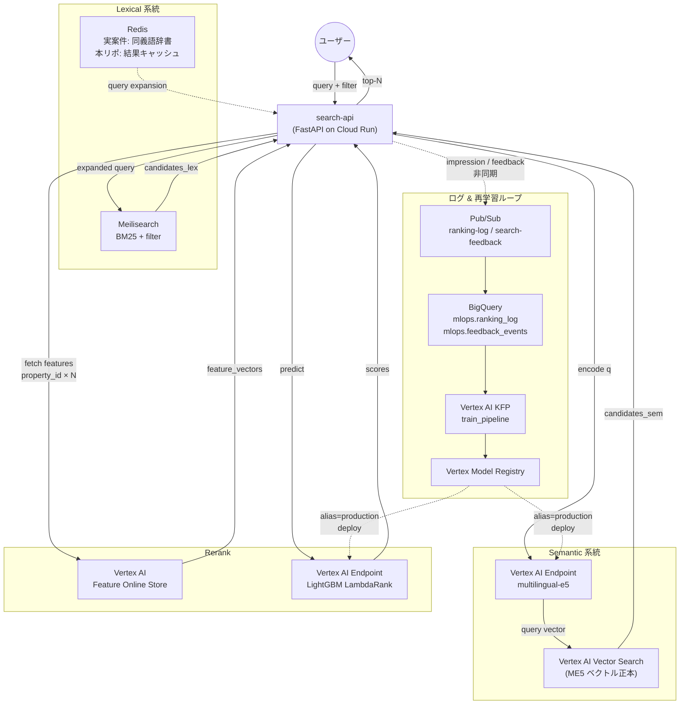
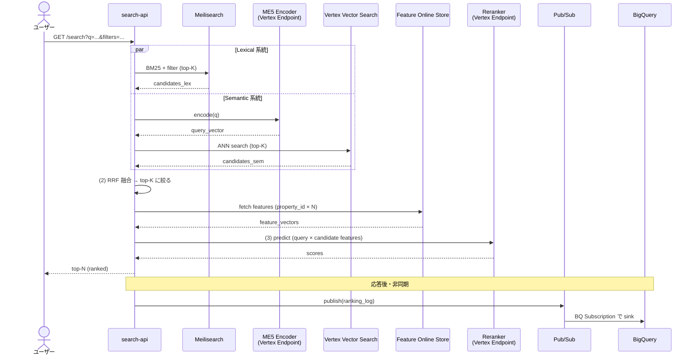
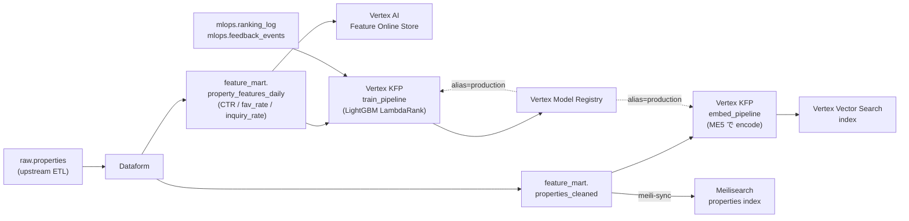
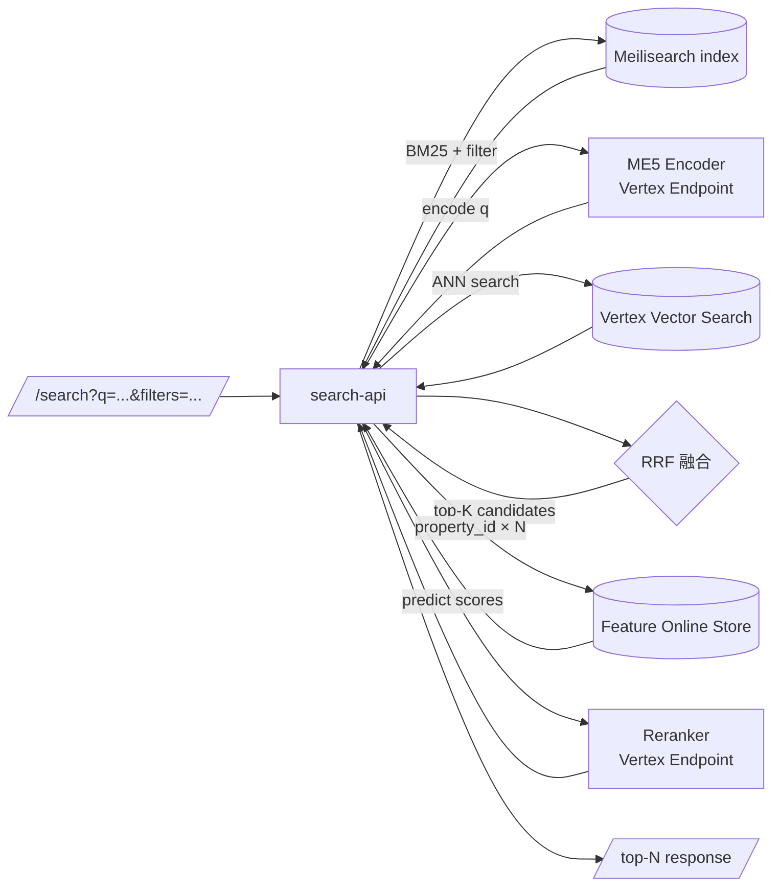
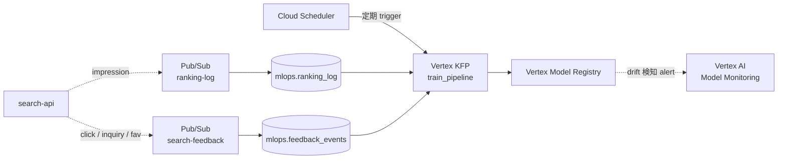

# 01 仕様と設計

ルート `docs/` の本ファイルは、Phase 1〜7 の仕様設計を横断するハブです。  
正本は各 Phase 配下の `README.md` / `CLAUDE.md` / `docs/` であり、全体方針の基準はリポジトリ直下の [`README.md`](../README.md) とします。

## 位置付け

- 本ファイルの役割は、`README.md` に沿って Phase 全体像と共通制約を短く整理し、各 Phase の正本へ案内すること
- 実装詳細や Phase 固有ルールは、必ず対象 Phase 配下ドキュメントを優先すること
- ルート `docs/` は Phase 横断ナビゲーションであり、Phase 個別仕様の置き換えではない

## Phase 設計の軸

- Phase 1: **ML 基礎に集中**（学習・評価・保存）
- Phase 2: **App / Pipeline / Port-Adapter** を導入
- Phase 3-5: 不動産検索ドメインで **Local → GCP → Vertex AI** へ展開
- Phase 6: Phase 5 と**同じ不動産ハイブリッド検索ドメインを維持**し、PMLE 試験範囲の追加技術を Phase 5 実コードに **adapter / 副経路 / 追加エンドポイント / 追加 Terraform** として統合
- Phase 7: **Phase 6 の serving 層を GKE + KServe に置き換える到達ゴール**（Vertex AI Pipelines / **Vertex AI Feature Store + Feature Group + Feature Online Store** / **Vertex Vector Search** / Model Registry / BigQuery / Meilisearch 等は Phase 6 から継承。Feature Online Store は Phase 5 構築済を KServe から opt-in 参照）

## 設計思想の不変性

- Phase 間のコードは原則共有しない（教材としての独立性を優先）
- ただし **設計思想（Port/Adapter、`core → ports ← adapters`、依存方向）は一貫** させ、**adapter 実装だけ差し替える**
- 実行方式の段差（Docker Compose → uv + クラウド → Vertex AI → GKE）は、同じ設計思想を保ったまま実行基盤だけを段階的に差し替える学習設計である

## Phase 一覧

| Phase | ディレクトリ | テーマ | 主な学習ポイント | 主な技術 | 実行方式 |
|---|---|---|---|---|---|
| 1 | `1/study-ml-foundations/` | ML 基礎（回帰） | preprocess / feature engineering / training / evaluation / artifact 出力（`model.pkl` / `metrics.json` / `params.yaml` / `runs/{run_id}/`） | LightGBM, PostgreSQL | Docker Compose |
| 2 | `2/study-ml-app-pipeline/` | App + Pipeline + Port/Adapter | FastAPI lifespan DI, `core → ports ← adapters`, predictor 経由推論、seed/train/predict job 分離 | FastAPI, LightGBM, PostgreSQL | Docker Compose |
| 3 | `3/study-hybrid-search-local/` | 不動産ハイブリッド検索（Local） | lexical + semantic + rerank、LambdaRank、RRF、Port/Adapter 実践 | Meilisearch, multilingual-e5, LightGBM LambdaRank, Redis, uv | uv + Docker Compose |
| 4 | `4/study-hybrid-search-gcp/` | 不動産ハイブリッド検索（GCP） | GCP マネージドサービス化、RRF、再学習ループ、IaC/CI、**BigQuery feature table / view の土台作成**（Phase 5 Feature Store の入力源）、**Secret Manager → Cloud Run secret injection（必須習得）** | Cloud Run, GCS, BigQuery, Cloud Logging, **Secret Manager**, **Pub/Sub, Eventarc, Cloud Scheduler, Artifact Registry, Cloud Build**, Terraform, WIF, GitHub Actions | uv + クラウド実行基盤 |
| 5 | `5/study-hybrid-search-vertex/` | Vertex AI 標準 MLOps 差分移行 | Vertex Pipelines（KFP v2） / Endpoint / Model Registry / Monitoring / Dataform への adapter 差し替え、**Feature Store / Feature Group / Feature Online Store による training-serving skew 防止を必須化**、**Vertex Vector Search を ME5 ベクトルの正本ストアに採用**（Phase 4 の BigQuery `VECTOR_SEARCH` を置換） | Vertex AI Pipelines, Vertex AI Endpoint, **Vertex AI Feature Store, Vertex Feature Group, Vertex Feature Online Store**, **Vertex Vector Search**, Vertex AI Model Registry, Vertex AI Model Monitoring, Dataform, Cloud Function（Gen2） | uv + Vertex AI |
| 6 | `6/study-hybrid-search-pmle/` | GCP PMLE 追加技術ラボ（Phase 5 実コードへ統合） | PMLE 範囲の追加技術を adapter / 副経路 / 追加エンドポイント / Terraform として統合。default flag では Phase 5 挙動維持。**Feature Store は Phase 5 前提**とし、本 Phase では Dataflow / Scheduled Query による特徴量生成・更新（Feature Store 更新パイプライン）を強化。不変はハイブリッド検索中核（`/search` default）のみ | BQML, Dataflow（Apache Beam Flex Template）, Monitoring SLO + burn-rate alert, TreeSHAP（Explainable AI）, Scheduled Query, **Feature Store 更新パイプライン** | uv + Vertex AI + Terraform |
| 7 | `7/study-hybrid-search-gke/` | GKE/KServe 差分移行（到達ゴール） | Phase 6 の serving 層を GKE + KServe へ置換。Kubernetes 運用論点は抑え、まず動かす。SLO は `k8s_service` 化し、TreeSHAP 用 explain 専用 Pod と、**Phase 5 で構築済みの Feature Online Store を KServe から opt-in 参照する経路** を追加 | GKE Autopilot, KServe, Gateway API + HTTPRoute, External Secrets Operator, Workload Identity, GMP（PodMonitoring）, HPA, IAP（GCPBackendPolicy）, NetworkPolicy, Helm provider, Vertex AI Feature Online Store（Phase 5 構築済を opt-in 参照） | uv + GKE Autopilot/KServe |

## ハイブリッド検索の仕様と設計（Phase 3-7 共通）

> Phase 3 以降の題材は **不動産ハイブリッド検索** で固定。本セクションは Phase 横断で不変な仕様・設計と、Phase ごとに差し替わる adapter を 1 つの表で見渡すための正本。詳細は各 Phase 配下の `docs/01_仕様と設計.md` を参照。

### 1. 題材と機能仕様

- **ドメイン**: 不動産検索
- **ユースケース**: 自由文クエリ + 構造化フィルタ（`city` / `price_lte` / `walk_min` など）→ 物件ランキング上位 N 件

| 項目 | 値 |
|---|---|
| エンドポイント | `GET /search`（中核挙動）、`POST /feedback`（行動ログ受付） |
| 入力 | 自由文クエリ + フィルタ + `limit` |
| 出力 | property ID + score + ハイライト + ranking 上位 20 件 |
| ranking ログ | `ranking_log`（クエリ / 候補 / rank / scores / impression）/ `feedback_events`（クリック / 問い合わせ / お気に入り） |
| 再学習ループ | `ranking_log` ＋ `feedback_events` を学習データとして LightGBM LambdaRank を定期再学習 |

### 2. 設計（3 段構成）

クエリ受領 → 2 系統で候補取得（並列）→ RRF 融合 → LightGBM 再ランク → 返却。下の図はすべて Phase 5 (Vertex AI 標準 MLOps) の構成を基準にしている。

#### 2.1 関係図（コンポーネント間の依存）

#### 2.2 シーケンス図（`/search` の 1 リクエストの流れ）

#### 2.3 段表

| 段 | 役割 | アルゴリズム / 技術 |
|---|---|---|
| (1a) Lexical | キーワード一致 + 構造化フィルタによる候補抽出 | BM25（Meilisearch / Elasticsearch 等） |
| (1b) Semantic | 意味類似による候補抽出 | multilingual-e5 で encode → ベクトルストアで ANN |
| (2) 融合 | 異種 score の順位を統合し top-K に絞る | Reciprocal Rank Fusion (RRF) |
| (3) Rerank | 学習済モデルで最終ランキング | LightGBM LambdaRank（NDCG@K で評価） |

### 3. 不変ルール（Phase 3-7 共通）

- **中核 5 要素の挙動・データフロー・デフォルト `/search` 応答は維持**: Meilisearch BM25 / multilingual-e5 / ベクトルストア（Phase 4 = BigQuery `VECTOR_SEARCH` / Phase 5+ = Vertex AI Vector Search）/ RRF / LightGBM LambdaRank
- **置換・削減・無効化は事前の明示合意を必須**（過去に AI が中核を勝手に書き換えた事故あり）
- **Port/Adapter 境界**: lexical retriever / semantic encoder / semantic vector store / reranker / feature fetcher / ranking log の 6 軸はすべて Port 経由で抽象化し、adapter だけ差し替える

### 4. Phase 別の実装段差（中核は不変、adapter だけ差し替え）

| 段 / 関心事 | Phase 3 (Local) | Phase 4 (GCP) | Phase 5-7 (Vertex AI) | 実案件 reference |
|---|---|---|---|---|
| (1a) Lexical | Meilisearch (Docker) | Meilisearch on Cloud Run | Meilisearch on Cloud Run（据え置き） | **Elasticsearch** |
| Lexical 補助 | Redis (結果キャッシュ) | Redis (結果キャッシュ) | Redis (結果キャッシュ) | **Redis 同義語辞書**（「マンション」→「アパート / 共同住宅」のような query expansion 辞書） |
| (1b) Semantic encoder | multilingual-e5 (local) | multilingual-e5 (Cloud Run) | multilingual-e5 (Vertex AI Endpoint / KServe) | 同一 |
| (1b) Semantic vector store | pgvector / 簡易 ANN | **BigQuery `VECTOR_SEARCH`** | **Vertex AI Vector Search**（ME5 ベクトル正本） | 同一 |
| (2) 融合 | RRF | RRF | RRF | 同一 |
| (3) Rerank | LightGBM LambdaRank（in-process） | LightGBM LambdaRank (Cloud Run) | LightGBM LambdaRank (Vertex AI Endpoint / KServe) | 同一 |
| 特徴量管理 | local files | BigQuery feature table / view | **Vertex AI Feature Store + Feature Group + Feature Online Store**（必須、training-serving skew 防止） | 同一 |
| ranking log | local SQLite / Postgres | BigQuery `mlops.ranking_log`（Pub/Sub → BQ Subscription） | 同上 | 同一 |
| 再学習トリガ | 手動 | Cloud Scheduler + Cloud Function | Vertex AI Pipelines schedule | 同一 |
| モデル管理 | local artifact | GCS | Vertex Model Registry（昇格運用） | 同一 |
| 監視 | 手動 | Cloud Monitoring | Cloud Monitoring + Vertex Model Monitoring | 同一 |

**「中核」(Meilisearch / multilingual-e5 / RRF / LightGBM LambdaRank)** は Phase 3-7 共通で不変。それ以外は adapter 実装を差し替える設計。

### 5. データフロー図（Phase 5 を例に）

#### 5.1 オフライン: 特徴量・埋め込み・モデルの生成

#### 5.2 オンライン: `/search` のオーケストレーション

#### 5.3 ログ → 再学習ループ

### 6. 実案件 reference architecture

「実案件で Vertex AI 標準 MLOps を本番運用するときの理想構成」は Phase 5 [`docs/01_仕様と設計.md` §「実案件想定の reference architecture」](../5/study-hybrid-search-vertex/docs/01_仕様と設計.md) を正本とする。

要約: **Elasticsearch + Redis 同義語辞書 + multilingual-e5 + Vertex AI Vector Search + RRF + LightGBM LambdaRank**。本リポは Meilisearch + Redis cache を **学習用 substitute** として据え置き、Port/Adapter で `MeilisearchAdapter` ↔ `ElasticsearchAdapter` および `ResultCache` ↔ `SynonymExpander` の差し替えで上記 reference architecture に到達できる構造を維持する。Meilisearch を据え置く理由は親 [`README.md` §「検索エンジン(Phase 3 以降): Meilisearch」](../README.md) を参照。

## 共通非負制約

### 全 Phase 共通

- 教材対象外技術は導入しない
- 設計思想（Port/Adapter / 依存方向 / `core → ports ← adapters`）を破壊しない
- Phase 間のコード共有や広域リファクタは原則行わない

### Phase 3-7（ハイブリッド検索系）

- ハイブリッド検索中核（前述 §3 不変ルール）を維持
- 検索品質改善はこの基本構成を前提に行う
- 置換・削減・無効化は事前の明示合意を必要とする

### Phase 6 追加（PMLE 統合特有）

- **題材は Phase 5 と同じ不動産ハイブリッド検索ドメインを維持**
- **ハイブリッド検索中核コード（Meilisearch BM25 + Vertex Vector Search + multilingual-e5 + RRF + LightGBM LambdaRank）の挙動は絶対に変えない**（Phase 6 起点。Phase 4 のみ semantic 経路を BigQuery `VECTOR_SEARCH` で代替する）
- **中核以外の改変は PMLE 学習のため自由に行う**
- **default feature flag では Phase 5 挙動を維持**（新技術は opt-in）
- **`make check` / parity invariant / Port/Adapter 境界検知 / WIF** は追加コードも含めて継続して PASS させる

### Phase 7 追加（到達ゴール）

- **Phase 6** の学習/データ基盤をそのまま継承し、serving 層のみ差し替える

## 教材対象外（全 Phase 禁止）

- **Agent Builder / Vizier / Model Garden / Gemini RAG** は、ハイブリッド検索中核と機能カニバリを起こすか学習価値が低いため、全 Phase で導入・言及しない
- **Vertex Vector Search** は Phase 5 以降の semantic 検索の正本ストアとして採用する（実案件想定）。Phase 4 のみ BigQuery `VECTOR_SEARCH` 経路を学習目的で残す
- **W&B / Looker Studio / Doppler** は教材対象外（2026-04-24 決定）

## 運用・成果物の置き場

- Phase 1-3: ローカル成果物（`model.pkl` / `metrics.json` / `params.yaml` / `runs/{run_id}/` + git commit hash）
- Phase 4: GCS / BigQuery / Cloud Logging / Cloud Monitoring / GitHub Actions + WIF / Terraform / **Secret Manager** / **BigQuery feature table・view**(Phase 5 Feature Store の入力源を準備)
- Phase 5: Vertex Model Registry / Vertex Pipelines / Metadata / Vertex Endpoint / Vertex Model Monitoring / **Vertex AI Feature Store + Feature Group + Feature Online Store(training-serving skew 防止のため必須)** / **Vertex Vector Search(ME5 ベクトル正本)**
- Phase 6: Phase 5 を継承し、追加技術は adapter / 副経路 / 追加エンドポイント / 追加 Terraform として統合(本 Phase では Dataflow / Scheduled Query で Feature Store の入力生成・更新を強化)
- Phase 7: Phase 6 から学習/データ基盤を継承し、serving 層のみ GKE + KServe に差し替える（Meilisearch master key は External Secrets Operator で GCP Secret Manager から K8s Secret へ自動同期）。KServe から Vertex AI Feature Online Store を opt-in 参照する経路を追加

## 必須習得（Phase 4 以降）

- **Secret Manager**: 題材は Meilisearch master key。Secret 作成 → SA IAM bind → Cloud Run `--set-secrets=MEILI_MASTER_KEY=meili-master-key:latest` 注入 → app 側 pydantic-settings 読み取りの 4 段を踏む

## Phase 別正本リンク

- Phase 1: [`../1/study-ml-foundations/docs/01_仕様と設計.md`](../1/study-ml-foundations/docs/01_仕様と設計.md)
- Phase 2: [`../2/study-ml-app-pipeline/docs/01_仕様と設計.md`](../2/study-ml-app-pipeline/docs/01_仕様と設計.md)
- Phase 3: [`../3/study-hybrid-search-local/docs/01_仕様と設計.md`](../3/study-hybrid-search-local/docs/01_仕様と設計.md)
- Phase 4: [`../4/study-hybrid-search-gcp/docs/01_仕様と設計.md`](../4/study-hybrid-search-gcp/docs/01_仕様と設計.md)
- Phase 5: [`../5/study-hybrid-search-vertex/docs/01_仕様と設計.md`](../5/study-hybrid-search-vertex/docs/01_仕様と設計.md)
- Phase 6: [`../6/study-hybrid-search-pmle/docs/01_仕様と設計.md`](../6/study-hybrid-search-pmle/docs/01_仕様と設計.md)
- Phase 7: [`../7/study-hybrid-search-gke/docs/01_仕様と設計.md`](../7/study-hybrid-search-gke/docs/01_仕様と設計.md)

## 参照優先順位

1. 各 Phase 配下の `README.md` / `CLAUDE.md` / `docs/`
2. リポジトリ直下の [`README.md`](../README.md)
3. ルート `docs/` の横断ハブ（本ファイル / `03_実装カタログ.md` / `04_運用.md`）
